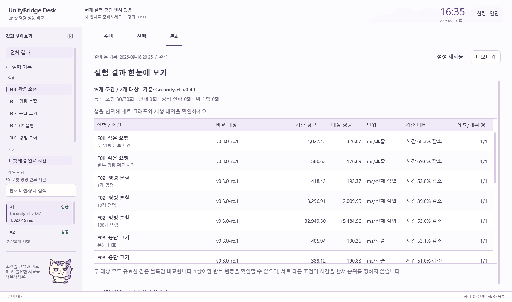
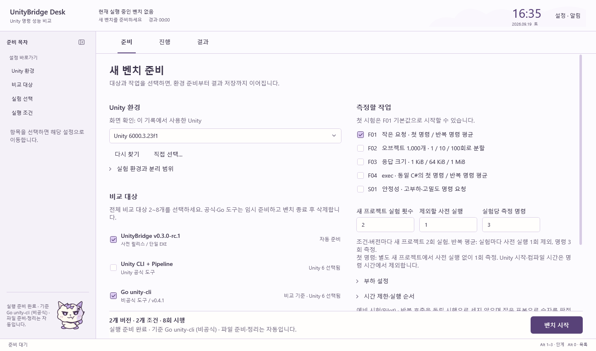

# 2026-09-19 화면 적용 기록

## 구현 전 결정

frontend-design의 제품 내용에 근거한 시각 구성, UI/UX Pro Max의 탐색·입력·접근성 지침을 UI-DESIGN-WORKFLOW.md와 결합한다. 두 외부 SKILL.md와 quick-reference.md는 직전 작업에서 원문을 확인했다. 스킬 검색 스크립트는 실행하지 않았으며 웹용 레이아웃·폰트·애니메이션 예제는 복사하지 않는다.

현재 UI-NAVIGATION.md, RESULTS.md, DEVELOPMENT.md와 앞서 확인한 THEME-ASSETS.md·MOTION.md를 기준으로 한다. 준비·진행·결과는 각각 설정 행, 실행 단계, 비교표와 세로 그래프를 중심으로 구성한다. 파스텔·연보라·작은 구름 고양이를 보존한다.

- 준비: 도구마다 다른 선택 표현을 같은 높이의 대상 행으로 정리한다. 버전·호환 조건을 이름 가까이 두고 실행 계획은 하단에 유지한다.
- 결과: 전체 실험·조건·비교 대상의 표를 첫 화면으로 두고, 선택한 행에서 기존 그래프·비교·시행 상세로 연결한다. 비교표는 공동 유효 블록의 기존 집계만 사용한다.
- 상세: 비교 대상과 기준을 제목에서 읽고 평균 차이·시행 범위를 바로 아래에 표시한다. 그래프의 전체 유효 시행 평균은 별도로 명시한다.
- 탐색: 조건별 필터·시행 선택·보기와 스크롤을 기억한다. 번호·버전·상태와 시간을 좌측에서 읽는다.
- 반응: 그래프의 포인터·키보드 선택을 강조한다. 실행 중인 벤치와 열어 본 기록의 상태를 구분한다.

장식용 영문 소제목·중복 제목·큰 숫자 중심 요약을 줄인다. 한글 본문과 버전명에 익숙한 Windows 글꼴을 유지하고 숫자는 표 형태로 정렬한다. 모든 요소를 카드로 감싸지 않고 역할별 행·여백·구분선을 사용한다. 스타일 이름이나 낯선 폰트 자체로 개성을 만들지 않는다.

## 검증

전체 Verify 검사가 통과했다. 빌드 경고·오류 0개, Core 38개·Infrastructure 181개·Desktop 28개, 총 247개이다. 기존 WPF 렌더 검증에 공동 유효 평균 유지, 전체 비교표 연결, 조건·기록 전환 후 필터·시행·스크롤 복원, 진행 실패 필터 검사를 추가했다. 메뉴의 구분선과 키보드 열기·닫기도 검증했다.

600개 합성 시행의 목록 가상화와 원래 번호를 확인했다. 100·150·200% 렌더링 검사와 작은 창의 탐색 공간·버튼 잘림·중첩 스크롤 검사를 통과했다. 실제 화면 확인에서 발견한 비교표 열 너비, 입력칸의 중복 여백, 메뉴 구분선 스타일 충돌을 보정했다.

이전에 완료한 Go 비교 기록(30개 시행·286개 샘플)을 읽어 1440×850 및 960×600에서 전체 결과·조건 그래프·시행 상세·준비 화면을 확인했다. 준비 미리보기는 기록의 Unity와 대상 정보를 입력한 화면 확인용이며 새 실험을 실행한 증거가 아니다. 원본 기록은 수정하지 않았다.

스킬 설치·스타일 검색 데이터베이스 실행·새 Unity 벤치·유료 모델 호출은 수행하지 않았다. 화면 검토는 참고자료 조합에 대한 구현 확인이며 사용성 실험이나 독창성의 객관적 인증을 뜻하지 않는다. 탐색 상태 보존은 현재 창의 메모리 범위이다.

## 작업 탭 후속 정리

준비·진행·결과 탭에서 선택 밑줄, 보라색 포커스 바탕, WPF 기본 점선이 겹쳤다. 앞서 읽은 frontend-design의 시각적 우선순위와 UI/UX Pro Max의 선택·포커스 구분 원칙을 현재 UI-NAVIGATION.md와 조합했다. 탭 이름 앞의 번호는 제거하고, 같은 너비의 조작 영역과 짧은 밑줄을 사용한다. 순차 완료를 요구하는 단계 표시나 별도의 이동형 패널은 도입하지 않는다.

마우스로 선택하면 글자와 밑줄로 표시한다. 키보드 탐색에 사용하는 기본 FocusVisualStyle은 얇은 실선 템플릿으로 교체하고, 기존의 포커스 바탕 채우기는 제거했다. 포인터에는 옅은 바탕만 표시하며, 밑줄 위치를 흔드는 탭 전체의 눌림 축소 효과는 제거했다. Alt+1·2·3과 기존 전환 동작은 보존한다.

후속 수정 후 Desktop 검사 28개가 통과했다. 실제 WPF 화면을 1440×850·960×600으로 확인했고, 독립된 WPF 탭에서 100·150·200% 포커스 표시를 렌더링했다. 미리보기에서 프레임워크의 포커스 장식을 명시적으로 표시했으며, 방향 탐색으로 준비에서 진행으로 포커스와 선택이 함께 이동함을 확인했다. 전체 247개 검사 통과 기록은 위의 선행 개편 검증이며, 이 작은 스타일 변경 뒤에는 Desktop 검사만 다시 실행했다.

## 접힌 사이드바 후속 정리

접힌 탐색 영역의 화살표와 좁은 ‘목록’ 버튼이 같은 동작을 중복 표시했다. 앞서 읽은 frontend-design의 시각적 우선순위, UI/UX Pro Max의 명확한 조작 영역·키보드 접근 원칙을 현재 UI-NAVIGATION.md와 조합한다. 하나의 패널 윤곽 아이콘 안에 접기·펼치기 방향을 표시하고, 평상시 보라색 채움과 세로 글자를 제거한다. 새로운 장식이나 이동형 패널은 도입하지 않는다.

버튼은 36×36 DIP의 고정 조작 영역을 가지며 상단 작업 탭과 중심을 맞춘다. 포인터에는 옅은 배경과 툴팁을 표시하고 키보드에는 얇은 실선 포커스를 표시한다. 현재 동작을 접근성 이름에도 반영한다. 232/52 DIP 탐색 너비와 Alt+0, 기존 전환 모션을 유지하며 접힌 상태의 빈 하단 구분선도 숨긴다. 측정·집계 로직은 변경하지 않는다.

수정 후 Desktop 검사 28개가 통과했다. 실제 WPF 렌더링으로 1440×850의 펼친 탐색 영역과 960×600의 접힌 탐색 영역에서 아이콘 위치·버튼 잘림·상단 정렬을 확인했다. 이번 변경을 확인하기 위해 새 Unity 실험이나 유료 모델 호출을 실행하지 않았다.
