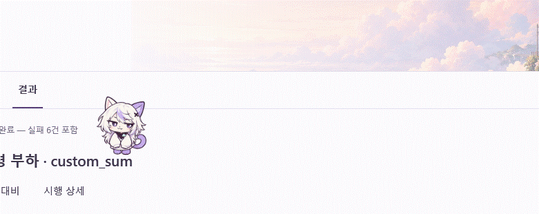

# 아샤 행동 연결 개선

2026-09-19 · Desk v0.4.0

이동·회전·대기·탐색·화면 복귀·장난을 연결한다. 기존 외형과 8개 그림을 유지하고, 동작의 시간과 자세 변형을 조정한다. 실제 3D 회전이나 새 Live2D 모델을 추가한 것은 아니다.

## 걷기와 돌아보기

걷는 그림은 시간 대신 실제 이동 거리에 따라 바꾼다. 9.75 DIP마다 다음 발걸음 그림을 사용하고 39 DIP에서 한 주기를 마친다. 얌전함·보통·활발함의 속도는 45·65·85 DIP/s이며, 출발과 정지는 최대 0.22초에 걸쳐 속도를 바꾼다. 같은 방향으로 이어지는 발판 구간에서는 중간에 다시 멈추거나 보행 주기를 초기화하지 않는다. 입력에 대한 정지는 즉시 처리하고, 공중에서는 기존처럼 착지를 마친다.

방향 전환은 약 0.34초이다. 시선이 먼저 이동하고 고개가 작게 돌아간 뒤, 약 0.20초 시점에 정면에 가까운 기존 그림의 방향을 바꾼다. 몸을 납작하게 줄이는 효과는 사용하지 않는다. 살피기·대기·설정 팝업 정지에서도 마지막 방향을 유지한다. 걷는 거리가 없으면 발걸음도 진행하지 않는다.

## 장소와 직전 행동을 반영한 자세

발판 폭이 캐릭터 폭의 1.6배보다 좁으면 대기 시 발을 조금 모은다. 넓은 발판에서는 기존 호흡·귀·꼬리·시선 반응에 약 1.5초의 작은 기지개가 추가된다. 기지개는 소매와 앞발 주변의 변형이며 머리나 몸 전체를 반복해서 늘리지 않는다. 대기 동작은 다음 탐색 시간을 늦추지 않는다.

충격이 큰 착지로 하나의 이동을 마쳤을 때는 약 0.55초 동안 앞발과 몸을 정돈한다. 같은 정돈은 최소 18초 간격으로 제한한다. 끌어놓기에는 약 0.18초의 착지와 약 0.55초의 정돈을 연결하고 클릭 장난으로 처리하지 않는다. 기존의 긴 강제 휴식·자동 수면 제외 원칙을 유지한다.

## 목적이 보이는 탐색

검증된 목적지의 높이 차이로 탐색·올라가기·내려가기 의도를 정한다. 출발 전에는 중간 발판만 보는 대신 최종 목적지 방향과 높이를 먼저 살핀다. 이후 같은 계획을 따라 접근·방향 전환·웅크림·점프 또는 내려다보기·뛰어내리기·착지로 이어진다. 새로운 화면이나 사용자 입력은 계획을 중단할 수 있다. 목적지는 기존의 도달 가능성·방문 이력 기준을 유지한다.

## 화면과 발판별 기억

준비·진행·결과·기록은 서로 다른 방문 이력을 가진다. 떠날 때 마지막으로 지지된 위치와 바라보는 방향을 기억한다. 좌표 외에도 이름이 있는 UI 요소 또는 이름 없는 요소의 구조상 경로로 발판을 구분하고, 발판 위 상대 위치를 저장한다. 되돌아오면 해당 발판의 현재 위치에서 안전한 착지 후보를 찾는다. 발판이 사라졌으면 가까운 안전한 후보를 찾고, 후보가 없으면 숨는다.

화면 전환 때 먼저 아샤를 숨겨 새 내용 위로 가로질러 이동하지 않게 한다. 새 배치를 확인한 뒤 안전한 위치에서 약 140ms 동안 나타난다. 움직임을 껐거나 벤치 중이면 이 효과도 사용하지 않는다. 기억은 현재 실행 세션 안에만 두고 새 파일을 만들지 않는다. 현재 앱에서는 네 화면을 사용하고, 재사용 시에도 최대 12개 화면과 화면당 최대 256개 방문 구역으로 제한한다.

## 클릭 반응

첫 입력은 약 0.65초의 힐끔 보기, 다음 입력은 약 0.9초의 앞발 장난, 연속 입력은 약 0.8초의 시큰둥한 고개·시선 반응이다. 0.25초 안의 중복 입력은 무시하고 시큰둥한 단계에서는 최소 1.8초 간격을 둔다. 마지막으로 반영한 입력에서 5초가 지나면 첫 반응부터 다시 시작한다. 행동 대기열을 만들지 않으며 끌어놓기는 클릭 횟수에 포함하지 않는다.

## 디자인 기준과 범위

`AGENTS.md`, `design/UI-DESIGN-WORKFLOW.md`, `docs/ASHA.md`, `docs/MOTION.md`와 실제 코드를 확인했다. 같은 날 앞선 작업에서 읽은 frontend-design의 제품 고유 행동 표현과 UI/UX Pro Max의 입력 우선·움직임 제어 원칙을 조합했다. 외부 스킬 설치나 검색 스크립트 실행은 하지 않았다.

작은 장식·말풍선·상태 배지를 늘리지 않고 행동으로 아샤의 성격을 표현한다. 사용자가 원한 연속 탐색과 차분한 앱 화면을 함께 유지한다. 기존 그림을 사용하는 만큼 회전과 몸 정돈은 2D 자세 표현이다. 새 자세 전용 원화는 추가하지 않았다.

벤치 중, 설정 팝업, 비활성화·최소화·숨김·Windows 애니메이션 비활성화의 정지 조건을 보존한다. 새 반복 타이머와 AI 호출을 추가하지 않는다. 기존 프레임·이동 타이머를 사용하며 발걸음 갱신 때문에 같은 시점의 그림을 중복 계산하지 않는다. 실제 CPU·프레임 시간의 성능 향상을 수치로 주장하지 않는다.

## 확인 방법

거리와 프레임의 대응, 출발·정지와 중간 구간의 속도 연속성, 클릭 폭주·초기화, 발판 이동·소실·차단, 좁은 자리의 기지개 제한을 자동 검사한다. 실제 WPF에서는 방향 전환 순서, 자율 올라가기·내려오기, 입력 중 착지, 드래그 후 정돈, 페이지별 위치·방향·방문 이력 복귀와 정지 조건을 검사한다. 결과는 `TestResults/Desktop.AshaBehavior.trx`에 기록한다.

미리보기는 기존 S01 검증 기록을 읽은 별도 WPF 창에서 만든다. 자율 이동 영상은 연결된 발판에 시작 위치만 지정하며 목적지와 경로는 실제 로직이 고른다. 반응 영상에는 돌아보기와 세 번의 클릭에 해당하는 입력을 넣어 각 표현을 확인한다. 새 Unity 벤치나 유료 AI 호출은 실행하지 않는다.

Desktop 검사 52개가 모두 통과했다. 실제 결과 화면의 자율 이동 관찰에서는 약 668 DIP의 좌우 탐색과 회전·도약·내려다보기·하강을 확인했다. 화면 복귀 시 같은 발판 위치로 돌아오는 것도 확인했다. 새 정돈 동작과 페이지별 방문 이력 분리는 WPF 회귀 검사에 포함한다. 발걸음·방향·반응은 기존 그림을 실제 렌더링한 확대 이미지로 확인했다.

