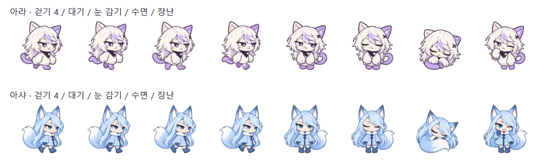

# 아샤와 아라의 외형 구분

후속 수정: 원본 그림은 유지하고 실제 키·발 위치 기준의 [크기 보정](CHARACTER-SCALE-AND-INDEPENDENCE.md)을 적용했다. 아래는 외형 제작 당시 기록이며, 현재 표시 크기는 투명한 칸의 크기가 아닌 보정 메타데이터를 사용한다.

2026-09-20 · 사용자는 두 캐릭터가 지나치게 비슷해 보인다고 피드백했다. 기존 아샤는 아라와 얼굴·앞머리·스웨터·목 장식의 구성이 같아 색상과 꼬리 외에는 구분이 약했다.

## 수정 방향

아라는 기존 은보라색의 헝클어진 장발, 졸린 눈매, 둥근 스웨터와 가는 꼬리를 유지한다. 아샤는 파스텔 아이스 블루를 유지하며 다음 부분을 편집한다.

- 머리: 매끈한 장발과 옆으로 넘긴 앞머리로 얼굴 주변의 윤곽을 구분한다. 사이드 테일은 만들지 않는다.
- 표정: 올라간 눈매와 호기심 많은 미소로 시큰둥한 아라와 대비한다.
- 의상: 둥근 스웨터·삼각 목도리를 짧은 A라인 케이프 코트·흰 칼라로 바꾼다.
- 종별 특징: 긴 여우 귀와 한 개의 큰 흰 끝 꼬리를 유지한다.

96 DIP 작업면과 64 DIP 설정 미리보기에서 식별할 수 있는 큰 형태에 집중한다. 작은 장식·발광·새 배경 효과를 추가하지 않는다. 이동·낙하·클릭 반응·개별 설정과 벤치 측정 로직은 이번 변경 범위에 포함하지 않는다.

## 사용 자료와 제작

내장 imagegen 스킬의 편집·투명도·원본 보존 원칙, [디자인 작업 기준](../design/UI-DESIGN-WORKFLOW.md)의 제품 고유성·작은 화면 검토, [캐릭터 설계](CHARACTERS.md)의 명확한 종별 구분과 정지 설정을 조합한다. UI 레이아웃이나 새로운 장식 모션은 도입하지 않는다. 외부 디자인 스킬을 새로 설치하거나 검색 프로그램을 실행하지 않았다.

내장 image_gen 편집 도구를 사용한다. 입력 1은 기존 아이스 블루 아샤, 입력 2는 변경하지 않을 아라의 비교 참고이다. 기존 파일들을 보존하고 새 시트는 별도로 저장한다. 자산 편집은 모두 내장 도구로 수행하며 별도 API·CLI 폴백이나 스크립트로 그림을 수정하지 않는다.

## 적용과 검증

최종 파일은 [asha-fox-distinct-sprites.png](../src/UnityBridgeDesk.Desktop/Assets/asha-fox-distinct-sprites.png)이다. 1774×887 RGBA이며 원본 알파를 유지한다. 앱의 여우 리소스를 새 파일로 연결했다.

새 시트의 넓은 여백과 행별 그림 크기에 맞춰 WPF가 읽는 프레임 영역을 지정했다. 걷기 행은 각 443픽셀 칸의 가로 시작에서 32픽셀, 시트 위에서 77픽셀 떨어진 350×350 영역이다. 아래 행은 각 칸에서 가로 70픽셀, 세로 58픽셀 떨어진 330×330 영역이다. 완성된 그림을 포함하면서 두 행의 표시 크기와 발 위치를 맞춘다. 신발이 프레임 높이의 약 92.5%에 오도록 해 기존 컨트롤 여백과 발판 기준을 유지한다. 프레임 읽기 영역만 조정하고 원본 PNG를 코드로 편집하지 않는다. 이후 다른 해상도의 시트로 교체하면 이 영역도 다시 검토해야 한다.

별도 상태 폴더의 실제 WPF 화면으로 준비·캐릭터 설정을 1440×850 및 960×660에서 렌더링했다. 96 DIP의 두 캐릭터 8개 프레임을 모두 나란히 확인하고, 64 DIP 설정 미리보기에서 얼굴·의상과 잘림을 검토했다. 인접 프레임의 선이 머리 위에 비치던 문제를 해결했다. 여우의 드래그 해제 후 낙하·발판 착지 검증도 통과했다.

전체 단위 검사는 이번 자산 수정에서 다시 실행하지 않았다. Unity 벤치와 사용자 데이터는 실행·변경하지 않았다.



## 실제 편집 프롬프트 · 외형 구분

```text
Use case: precise-object-edit.
Asset type: production transparent 4-column x 2-row animation sprite atlas for a 96px desktop companion.
Input 1 is EDIT TARGET, current pastel ice-blue fox girl ASHA. Input 2 is supporting COMPARISON ONLY, lavender cat ARA, whose design must NOT appear in the output.
Primary request: substantially redesign ASHA's hair, eyes, outfit and silhouette so she is unmistakably a DIFFERENT character from ARA even in grayscale at tiny size. Current fox is too similar to the cat, only a recolor. Keep same polished hand-drawn anime chibi family, clean dark muted blue-plum lines, adorable mischievous inquisitive personality, pastel ice-blue palette, female human-faced fox mascot, long hair, ONE very fluffy large fox tail with white tip.
ASHA's new identity: sleek long straight icy-blue hair flowing in two broad smooth tapered masses down her back, a CLEAR SIDE PART with a long sweeping diagonal fringe showing some forehead; no cat's jagged layered bangs, no messy fluffy bob, no ponytail or side-tail. Very tall slender pointed fox ears angled slightly outward, cool slate-blue tips. Sharper upturned almond-shaped blue-teal eyes, raised curious eyebrows, a small confident asymmetric mischievous smile; no heavy sleepy horizontal cat eyelids, no cat w-shaped mouth. Cute tiny face/chin, not a mature woman.
Replace the current round ivory sweater and triangular scarf/mint clasp with a simple PALE POWDER-BLUE SHORT A-LINE CAPE COAT, a pearl-white fluffy stand collar, dark blue-teal narrow central fastening and two small visible mitten hands emerging beneath it. Simple small slate-blue ankle boots. Distinct triangular shoulder-to-hem silhouette, not the cat's puffy sweater shape. No scarf, no mint clover clasp, no head accessory. Long hair stays loose. One large sweeping bushy tapered fox tail, icy blue with snowy white end, same cell-side as current frame. No multiple tails.
Keep exact atlas interface: 4 equal square columns x 2 rows, 2:1 canvas ideally 2048x1024, precisely eight complete full-body sprites, each fully contained in its own equal cell with a clear transparent gutter and 3-5% padding, same scale/head-body proportion and stable shoe baseline as edit target. Top row four distinct RIGHT-facing walk-cycle phases, same character and clothing throughout. Bottom row front idle with hands relaxed at coat sides; matching blink with eyes shut; curled sleeping wrapped in fox tail; playful wink with one mitten lifted. Match existing broad head/body/ear/tail locations so existing mesh animation remains natural. Feet groundline consistent in every non-sleep frame, not floating. Keep tail on left in right-facing walk frames, on right in front-facing frames. Preserve entire ears, hair, shoes and tail within each cell; do not cross cell divisions.
Genuine alpha transparent background, no checkerboard, no solid background, no grid, no labels, no text, no separate cat, no props, no glow, no sparkles, no snowflakes, no ground shadow. Deliver final sprite sheet only. The most important change is a new recognizable fox character silhouette and face, not another recolor of the cat.
```

## 실제 편집 프롬프트 · 프레임 여백과 투명 경계

첫 결과를 WPF에 연결해 작은 크기로 확인한 뒤 인접 프레임 일부가 비치는 문제를 발견했다. 외형은 유지하며 프레임 여백과 분리된 픽셀을 정리하는 두 번째 편집을 수행했다.

```text
Use case: precise-object-edit. Edit target is this finished ASHA ice-blue fox sprite atlas. Keep the new character EXACTLY: long sleek side-parted ice blue hair, long fox ears, blue-teal almond eyes and sly smile, powder-blue cape coat with fluffy white stand collar and two dark fastenings, slate boots, huge white-tipped blue fox tail. Keep all eight existing poses, line style and palette; do not redesign anything. ONLY correct atlas separation and alpha cleanliness for production. Exact 4 equal columns x 2 equal rows, 2:1 transparent canvas. Each sprite must be centered wholly inside its own square cell with a real empty transparent margin of at least 3% at ALL four cell edges. No ear, boot, tail, stray mark or white residue may cross any cell boundary or touch a boundary. All upright feet should share baseline at 96% of their cell height, ear tops at least 3% below cell top. Sleeping sprite stays entirely in its own cell. Top row four right-facing walk frames, lower row idle, blink, sleeping, playful wink. Preserve original relative head/body/feet positioning and approximate scale, only shrink minimally as needed to obtain safe gutters. Remove all detached speckles, colored alpha noise, white fringes and stray pixel fragments around the figures, leaving crisp clean anti-aliased silhouette edges on true alpha transparency. No background, no grid lines, no shadow, no labels, no text. This is an atlas cleanup, keep the fox character identity identical.
```

## 실제 편집 프롬프트 · 넓은 여백으로 재배치

두 번째 결과에서도 행 경계에 이전 프레임의 일부가 남아 있어, 세 번째 편집에서 외형을 유지하며 각 칸 안의 그림을 줄이고 여백을 명확히 확보하도록 요청했다.

```text
Use case: precise-object-edit. This is an atlas REPACKING task for the attached ice-blue fox girl ASHA, not a character redesign. Preserve exactly the same character, eight poses, colors and line art, including sleek side-parted long hair, fox ears and big fox tail, white-collared blue cape coat, mittens, boots. The present sheet has severe sprite bleed: top-row boots extend into the bottom-row cells, creating stray horizontal lines above the idle character's head in the app. SOLVE THAT by making all eight characters noticeably SMALLER and placing them on an exact 4 by 2 grid with LARGE completely transparent gutters. Use a 2:1 transparent canvas. Every equal square cell must have an empty 8% margin on the left, right, top AND bottom; each whole character including tail and ears fits inside the central 84% x 84% of its cell. Thus there is a large visible empty gap between the four walking sprites across the top and the four other poses across the bottom. All standing feet end at 92% of cell height, all ear tips below 8% of cell height. No boot, ear, hair or tail may touch a cell boundary. Do not preserve the previous crowded positions or full-bleed scale; uniformly scale down and recenter each sprite. Maintain top row right-facing walking frames 1/2/3/4; bottom row front idle, front blink, curled sleeping, playful wink. True alpha transparent entire background and gutters, zero detached speckles or colored residue, no grid, no text, no labels, no shadows, no borders, no white background. Make clear blank gutters the priority. The character design itself is final and must be preserved.
```
