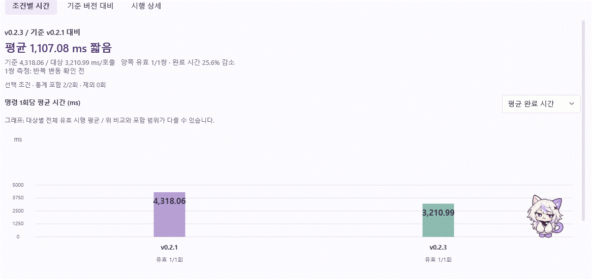

# 아샤의 그래프 놀이

2026-09-20 · Desk v0.4.0 후속 변경이다. 아샤가 결과 그래프의 낮은 막대에 올라간 뒤 높은 막대로 뛰고, 여러 막대를 오가며 짧게 노는 행동을 추가한다.

영상은 기존 완료 기록을 읽은 실제 WPF 결과 화면이다. 기본 시작 자리에서 출발했으며 목적지를 직접 지정하거나 이동 명령을 주입하지 않았다. 막대를 오가는 구간을 잘라 보여 준다. 화면의 수치는 이전 기록이고 새 Unity 벤치나 AI 호출을 실행하지 않았다.

## 행동의 흐름

1. 그래프 근처에서 도달 가능한 막대를 찾는다. 숫자나 버전 순위를 해석하는 대신 화면에 그려진 막대의 높이와 위치를 사용한다.
2. 놀이를 시작할 때는 가까운 범위에서 갈 수 있는 낮은 막대를 우선한다. 직접 갈 수 없으면 안전한 중간 발판을 거친다.
3. 착지한 뒤 위를 살피고, 가능한 경우 그다음 높은 막대로 점프한다.
4. 이후 아직 덜 밟은 막대를 우선하면서 가까운 곳과 먼 곳을 섞어 고른다. 두 막대만 있으면 왕복하고, 많아지면 여러 막대를 탐색한다.
5. 한 번의 놀이에서 5~9회 목적지에 도착한 뒤 일반 탐색으로 돌아간다. 놀이 사이에는 쉬는 간격을 둔다. 갈 곳이 없어지면 남은 계획을 버린다.

놀이 시작을 검토하는 첫 간격은 활성화 후 5~12초이다. 이후 놀이 종료·취소 시 다음 놀이까지 18~42초를 무작위로 고른다. 주변에 접근 가능한 막대가 없으면 3~7초 뒤 다시 검토한다. 이는 그래프 놀이의 간격이며 일반 탐색을 모두 정지시키는 시간이 아니다.

착지 후 대기는 보통 활동량에서 0.22~0.85초이며, 약 15%의 경우 1.1~1.8초 동안 조금 더 살핀다. 얌전함은 이 간격의 1.3배, 활발함은 0.8배를 사용한다. 방향 전환·웅크림·비행·착지를 실제 순서대로 마치므로 일정한 박자로 같은 동작을 반복하지 않는다. 입력 뒤의 3초 대기 등 조작을 보호하는 기준은 무작위로 바꾸지 않는다.

## 지형과 점프

`SpeedChartView`가 막대를 그릴 때 쓰는 좌표 계산을 `GetCompanionTerrain()`도 사용한다. 별도의 임의 막대를 만들지 않는다. 양수의 유효한 막대 윗면과 그래프의 기준선을 발판으로 사용하고, 0·측정값 없음은 막대 발판으로 만들지 않는다. 가려진 막대나 잘린 윗면도 착지 대상에서 제외한다. 그래프 조건·지표가 바뀌면 진행 중인 놀이를 취소하고 새 위치를 확인한다.

같은 그래프 안에서는 열 간격에 맞춰 수평 도달 범위를 250~720 DIP 안에서 조정하며 위아래 300 DIP까지 검토한다. 일반 화면의 이동 제한을 전체적으로 풀지 않는다. 주변 UI에서 그래프의 낮은 막대로 내려오는 진입에도 검증된 범위만 허용한다. 더 먼 곳은 중간 막대를 거치며, 경로가 없으면 뛰지 않는다.

그래프 점프는 먼저 몸을 띄우고 가로 방향으로 나아간 뒤 착지 때 가로 속도를 낮춘다. 가로 진행률에 `t²(3−2t)`를 사용하고, 세로는 기존 도약 곡선을 사용한다. 낮은 곡선부터 검사하고, 높은 막대 옆면에 걸릴 때만 도약 높이를 늘린다. 모든 경로는 몸 전체의 충돌과 창 경계를 검사한다. 넓은 간격에서는 비행 시간을 최대 1.9초까지 늘린다. 내려다보기·하강·착지는 기존 동작으로 이어진다.

## 숫자와 조작 보호

높은 막대에 서 있는 몸이 위 설명문을 가리지 않도록 그래프 내부 위쪽 여유를 확보한다. 표시 영역이 작은 창에서는 기존 스크롤로 아래 내용을 확인한다. 축과 막대에 같은 좌표식을 적용하며 값·축 상한·버전 순서·색·통계 계산은 유지한다.

아샤가 그래프에 접근하거나 놀이·진입·이탈 경로를 지나는 동안 값은 막대 안쪽에 표시한다. 짧은 막대는 옆 공간을 사용하며, 읽을 공간이 없으면 해당 숫자를 장애물로 보호한다. 떠난 뒤에는 원래 막대 위 표시로 돌아간다. 숫자를 숨기거나 다른 값으로 바꾸지 않는다. 놀이 중 값 표시를 다시 위로 복원해 캐릭터와 충돌하는 일이 없도록 경로가 끝날 때까지 유지한다.

아샤가 그래프 위에 있을 때는 마우스 입력을 그래프로 통과시킨다. 버전 선택·상세 열기·도움말·키보드 조작을 유지한다. 입력·스크롤이 들어오면 놀이를 취소하며 공중에 있으면 검증된 착지를 마친다. 설정 팝업, 벤치 중, 숨김, 움직임 끄기와 비활성화·최소화의 정지 조건도 유지한다. 새 반복 타이머나 API 호출은 없다.

## 디자인 근거와 검증

프로젝트의 `AGENTS.md`, `design/UI-DESIGN-WORKFLOW.md`, `ASHA.md`, `ASHA-FINE-SURFACES.md`, `MOTION.md`, `RESULTS.md`, `UI-NAVIGATION.md`, `DEVELOPMENT.md`를 확인했다. 앞선 작업에서 원문을 읽은 frontend-design의 캐릭터 고유 행동 표현과 UI/UX Pro Max의 읽기·입력 우선 원칙을 조합했다. 외부 스킬 설치·검색 스크립트 실행이나 새 이미지 생성은 하지 않았다. 이전의 ‘그래프 전체를 장애물로 둔다’는 기준은 이번 사용자 요청에 따라 막대와 숫자의 개별 처리로 바꾼다.

검사는 2·5·8개 막대와 세 가지 난수 시드에서 각각 20회 목적지 선택을 확인한다. 다수 막대 탐색, 낮은 막대 후 상승, 무작위 대기, 취소, 넓은 간격의 점프, 장애물·다른 그래프 구역을 가로지르지 않는지를 포함한다. 실제 WPF에서는 목적지를 주입하지 않고 세 개 이상의 막대를 방문하고, 점프 중에도 충돌 없이 이동하며, 스크롤 입력 뒤 멈추는지 확인한다. 값 표시 위치가 달라져도 막대 좌표·순서·원본 수치가 동일한지와 키보드 선택도 검사한다.

실제 1440×850 결과 화면에서 낮은 막대에 들어간 뒤 높은 막대로 올라가 여러 번 왕복하고 기준선으로 내려오는 모습을 확인했다. 960×660 화면에서도 보이는 발판으로 위치를 보정했다. 전체 Desktop 검사 **57개가 통과**했으며 결과는 `TestResults/Desktop.AshaChartPlay.trx`에 기록했다. 빌드 경고·오류는 0개이다.
