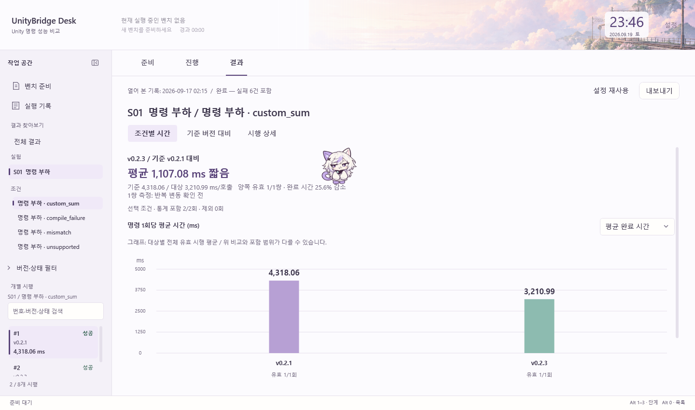

# 아샤 — 버튼과 보이는 텍스트 줄을 발판으로 사용

2026-09-19 · Desk v0.4.0 후속 변경이다. 사용자가 선택한 기준은 문법적인 문장 구분이 아니라 **화면에 실제로 보이는 각 줄**이다.

2026-09-20: [연속 구간과 접촉 계산](ASHA-CONTACT-GEOMETRY.md)으로 보완했다. 아래 초기 설계의 3 DIP 띄우기와 0.7초 갱신 대기는 제거했다. 옆으로 일부 가려진 발판도 원래 윗면이 보이면 남은 폭을 사용한다. 초기 검증 기록은 당시 구현 기준이다.

2026-09-20 [빈 발판 수정과 자유 낙하](ASHA-FALLING.md)에서는 버튼의 전체 클릭 영역 대신 실제 그려진 프레임·기호·글자를 사용하도록 보완했다. 아래 내용 중 버튼 전체 윗면은 프레임이 실제로 그려진 버튼에만 적용한다.

2026-09-20 후속 변경에서는 [그래프 놀이](ASHA-CHART-PLAY.md)를 추가했다. 아래의 그래프 전체 보호는 이전 기준이며, 현재는 막대를 발판으로 쓰되 수치·축·버전 표시를 따로 보호한다.

기존 완료 기록을 읽은 별도 WPF 창에서 실제 자율 이동을 관찰했다. 목적지를 주입하지 않고 기본 시작 자리에서 출발해 설명 줄 위로 내려왔다. 표시된 수치는 이전 기록이며 이번 UI 작업에서 새 벤치를 실행한 것은 아니다.

## 달라지는 동작

- 사용 가능한 버튼의 윗면을 각각 인식한다. 버튼 안의 글자는 중복 발판으로 등록하지 않는다.
- 제목과 일반 설명문의 각 줄을 실제 글자의 위치와 너비로 구분한다. 문단 전체를 하나의 직사각형 장애물로 사용하지 않는다.
- 도달 가능한 다른 버튼·텍스트 줄이 있으면 큰 구분선보다 목적지로 우선한다. 기존 구분선은 이동 연결과 대체 자리로 유지한다.
- 방문 이력은 버튼과 줄별로 기억한다. 가까운 두 버튼을 같은 공간 구역으로 취급하지 않는다. 긴 구조선에는 기존 공간 구역 기록을 유지한다.

## 계산 방법과 제한

`AshaTextLayout`은 WPF가 이미 그린 `TextBlock`의 `GlyphRunDrawing`을 읽는다. 문자열을 별도로 다시 배치해서 추정하지 않는다. 같은 줄에서도 글꼴·굵기에 따라 그리기 조각이 나뉘므로, 같은 기준선의 조각을 합쳐 한 줄의 윤곽 영역을 만든다. 실제 줄바꿈·패딩·정렬·혼합 글꼴·말줄임을 반영한다. [WPF 그리기 내용 읽기](https://learn.microsoft.com/en-us/dotnet/api/system.windows.media.visualtreehelper.getdrawing?view=windowsdesktop-10.0), [텍스트 그리기 자료형](https://learn.microsoft.com/en-us/dotnet/api/system.windows.media.glyphrundrawing?view=windowsdesktop-10.0)

그리기 그룹과 화면의 좌표 변환을 적용하고, 상위 요소와 스크롤 뷰에서 잘린 영역을 계산한다. 완전히 보이는 수평 윗면만 발판으로 사용한다. 0.01 DIP 미만의 좌표 반올림 차이를 실제 잘림으로 오판하지 않는다. 회전한 글·버튼은 수평 발판으로 만들지 않는다.

`AshaMap`은 두 발을 지지할 너비와 몸이 들어갈 공간을 확인한다. 현재 크기 96 DIP에서 중앙 30%, 약 28.8 DIP보다 짧은 줄은 읽어도 착지 후보가 되지 않는다. 신발은 글자 윗면에서 3 DIP 위에 맞추며 글자·버튼 주변에 2 DIP의 여유를 둔다. 걷기·도약·하강의 전체 경로에도 충돌 검사를 적용한다.

**모든 줄을 인식하는 것과 모든 줄 위에 설 수 있는 것은 다르다.** 일반 본문의 좁은 줄 간격에 캐릭터를 넣으면 앞줄을 덮게 된다. 이런 자리는 제외하고 위쪽 여유가 있거나 앞줄보다 옆으로 길게 나온 부분 등 공간이 있는 곳에 선다. 버튼도 위가 다른 조작 요소로 막히면 올라가지 않는다. 입력칸, 표·선택 목록의 내부 셀, 그래프는 계속 보호한다.

기존 약 0.7초 단위의 지도 갱신을 사용하며 스크롤·크기 변경·화면 전환 후 위치를 다시 확인한다. 잘려서 안 보이는 가지는 먼저 제외한다. 지도 도형이 같으면 연결을 재사용한다. 새 글이 아직 그려지지 않았을 때는 텍스트 영역을 임시 장애물로 두어 내용을 가로지르지 않는다. 새 반복 타이머나 AI 호출은 추가하지 않는다.

## 디자인 판단

`AGENTS.md`, [디자인 기준](../design/UI-DESIGN-WORKFLOW.md), [아샤](ASHA.md), [발판 설계 기록](ASHA-PERCH-DESIGN.md), [행동 연결](ASHA-BEHAVIOR-20260919.md), [모션](MOTION.md)을 코드와 함께 확인했다. 같은 날 앞서 원문을 읽은 frontend-design의 제품 고유 행동 표현과 UI/UX Pro Max의 읽기·입력 우선 원칙을 조합했다. 기존 문서의 ‘명시한 제목·테두리만 사용’은 최신 사용자 요청으로 대체한다. 외부 스킬 설치나 검색 스크립트 실행은 하지 않았다.

새 말풍선·장식·설정 항목을 추가하지 않고 작은 화면 요소를 알아보는 행동에 집중한다. 아샤를 위해 본문의 줄 간격이나 화면 배치를 바꾸지 않는다. 버튼의 클릭·포커스와 텍스트 자체를 보존한다. 입력 후 대기, 설정 팝업·벤치 중·비활성화·최소화·숨김·움직임 끄기의 정지 조건도 유지한다. 외형·테마와 벤치의 명령·측정·판정·집계는 바꾸지 않는다.

## 확인한 내용

Desktop 자동 검사 **53개가 모두 통과**했다. 기록은 `TestResults/Desktop.AshaFineSurfaces.trx`이다. 기존 전체 WPF 검사에 다음 확인을 추가했다.

- 한글 세 줄 분리, 가운데 정렬된 짧은 줄 위치, 충분한 간격의 둘째·셋째 줄 착지와 좁은 줄 사이의 가림 방지.
- 버튼 윗면·비활성 버튼 제외·기존 클릭 영역 보존.
- 폭 변경에 따른 재줄바꿈, 혼합 글꼴, 말줄임, 빈 텍스트와 1·1.5·2배 좌표 변환.
- 스크롤의 전체·부분 가림 및 사라진 줄의 발판 제거.
- 인접한 버튼·줄의 방문 기록 분리와 세부 발판 목적지 우선.

실제 1440×850 준비·진행·결과 화면과 960×660 결과 화면을 확인했다. 결과 화면에서 설명 줄 착지와 걷기·돌아보기·내려다보기·하강·착지·몸 정돈을 관찰했다. 모든 줄에 접근할 수 있다는 의미는 아니며 작은 창에서는 갈 수 있는 후보가 줄어든다. 새 Unity 실험이나 유료 AI 호출은 하지 않았다.
