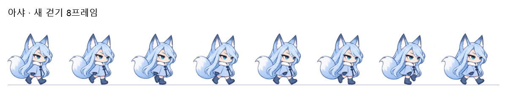
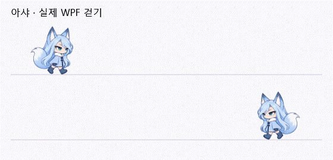

# 아샤의 걷기 수정

2026-09-20 · 사용자가 UnityBridge Desk와 리틀 모델 엔진 양쪽에 각각 적용하도록 지정했다. 자동 동기화는 추가하지 않는다.

## 문제와 변경

기존 걷기 네 장은 다리 배치가 거의 같아 발을 번갈아 딛는 모습이 약했다. 걷기 전용 8프레임을 별도로 제작하고, 발을 딛기·체중 이동·반대 발 지나가기·다음 접지 자세가 이어지게 한다. 대기·눈 감기·수면·장난·점프·낙하 그림은 기존 자산을 사용한다. 아라의 그림은 변경하지 않는다.

캐릭터 높이 96 DIP 기준 이동 48 DIP에 걷기 한 주기를 사용한다. 캐릭터를 크게 표시하면 보폭도 비례해 길어진다. 시간만 흘러서는 걸음이 바뀌지 않으며 실제 이동량을 받은 같은 화면 갱신에서 다음 포즈를 그린다. 정지 후 새로 걷기 시작할 때 접지 포즈부터 시작하고, 이어지는 보행은 주기를 유지한다. 여우에게 적용하던 몸 전체의 위아래 오프셋을 없애고 프레임 자체의 다리·몸 변화를 사용한다.

리틀 모델 엔진에서는 상태 재확인과 이동 갱신이 같은 이동량을 중복 반영하던 부분을 수정했다. 이동량은 한 번만 소비하고 공중 이동이나 드래그는 걸음으로 계산하지 않는다. 아샤의 지상 보행에는 출발·정지 시 최대 0.22초의 가감속을 적용한다. Desk는 기존 지상 보행의 가감속과 경로를 유지한다.

## 크기·발 위치와 독립성

각 프레임의 머리·몸 중심축과 지면에 닿는 신발 밑면을 보정한다. 서 있는 기준 키는 화면 크기의 84%, 발 위치는 89%로 유지한다. 꼬리와 들린 발 때문에 변하는 전체 외곽 사각형의 중심을 사용하지 않아 좌우 흔들림을 줄인다. 걷기 프레임 후반도 꼬리 방향을 같은 좌표로 처리한다.

양쪽 프로젝트는 새 파일을 각각 소유한다.

- Desk: `src/UnityBridgeDesk.Desktop/Assets/asha-fox-walk-v2.png`
- 리틀 모델 엔진: `src/UnityBridgeDesk.Companion/Assets/asha-fox-walk-v2.png`

제어 코드는 각각의 `DeskMascot.FoxWalk.cs`와 `FoxGait.cs`에 있다. 빌드 링크·공유 설정·자동 복사는 없으며 이후 다른 수정은 앱별로 적용한다. 기존 PNG는 보존한다. 벤치 명령·측정 구간·통계는 변경하지 않는다.

## 참고한 기준

`design/UI-DESIGN-WORKFLOW.md`, `docs/CHARACTERS.md`, `docs/MOTION.md`, `docs/CHARACTER-SCALE-AND-INDEPENDENCE.md`와 imagegen 스킬을 확인했다. 캐릭터 고유 외형 유지, 공간적 연속성, 정지·움직임 끄기를 우선한다. 추가 글로우·장식·반복 상하 흔들림은 넣지 않는다. 내장 image_gen으로 기존 아샤 시트를 참고해 걷기 전용 이미지를 제작했으며 Python으로 그림을 편집하거나 외부 API·CLI 폴백을 사용하지 않았다.

## 검증

실제 WPF에서 걷기 8프레임 × 크기 3종 × 배율 3종 × 좌우 2방향의 픽셀 경계를 검사한다. 신발 위치 오차 1.5 DIP 이내, 키 오차 2 DIP 이내, 잘림 없음과 포즈별 크기 유지를 확인한다. 이동 중 즉시 프레임 갱신, 이동 없이 걸음이 바뀌지 않음, 방향 전환, 정지 프레임 복원을 검사한다. 리틀 모델 엔진은 이동량의 중복 소비 방지·가감속·공중 이동 제외도 검사한다.





GIF는 화면 밖에 띄운 실제 WPF 캐릭터 컨트롤을 정해진 경로로 이동시켜 기록한 것이다. 사용자의 창이나 Unity 프로젝트를 조작하지 않는다.

## 실제 이미지 프롬프트

```text
Use case: precise-object-edit. Asset type: production transparent sprite atlas, a real eight-frame walking cycle for the existing ASHA fox-girl mascot in the reference.
Input image is IDENTITY AND STYLE REFERENCE: preserve this exact cute ice-blue fox character, head-body proportions, long side-parted hair, tall fox ears, sly blue teal eyes, pale blue cape coat with white fluffy collar, slate boots, one bushy blue fox tail with white tip, clean fine outlines, soft pastel shading. Do not redesign or recolor her.
Create ONE NEW WALK-ONLY sprite sheet, exact 4 equal square columns x 2 equal square rows, eight full-body frames in chronological reading order. 2:1 canvas, ideally 2048x1024. True alpha transparency. No idle/sleep/wink poses. All eight show the SAME walking character facing screen RIGHT at a consistent slight 3/4 side angle. Head, ear tips, waist and coat have consistent size and horizontal anchor across all frames.
CRITICAL: THIS MUST BE A GENUINE ALTERNATING-LEG WALK CYCLE, not eight copies of the existing same split-leg pose. Clearly draw DIFFERENT leg positions through contact, compression, passing and lift, then OPPOSITE legs for the second half. Keep two tiny separate boots visible, far boot slightly darker. Use natural modest stride; no running, no hop, no skating.
Frame 1: near leg forward with heel contacting ground, far leg behind with toe at ground.
Frame 2: near foot rolls flat and takes weight, far heel lifts with bent knee.
Frame 3: near foot under torso bears weight; bent far knee passes forward and its boot is visibly ABOVE ground.
Frame 4: near leg trails as far boot reaches forward for next heel contact.
Frame 5: far leg now forward heel contact, near leg behind toe contact: distinct OPPOSITE pose to frame 1.
Frame 6: far foot flat bears weight, near heel lifts and knee bends.
Frame 7: far foot under torso bears weight; bent near knee passes forward, near boot visibly ABOVE ground.
Frame 8: far leg trails as near boot extends forward for next heel contact, leading seamlessly to frame 1.
Hands swing very subtly opposite the legs. Hair and tail lag gently with weight shifts; no giant tail swings. No head turning or face variation between frames, no visual scaling changes. Front/rear boots alternate unmistakably, passing poses visibly narrower than contact poses.
Atlas safety: Every sprite including ears and tail fully contained in its own cell with 8% completely transparent margin on all sides. Shoe contact ground line at 90% of each cell height, ear tips around 10%, torso centered near 56% cell width. Keep common scale and ground line, allow at most tiny natural body rise. Large clean gutters with absolutely no isolated specks, frame bleed, shadows or stray marks. Do NOT draw the grid or labels. No text, backdrop, glow, floor, checkerboard or accessories. Final output is the single transparent eight-frame WALK atlas only.
```
