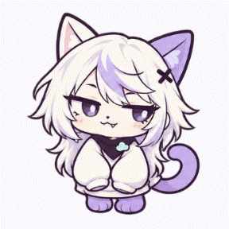

# 아샤 — 높은 자리를 찾아가는 동반자

> **현재 이름과 동작:** 아래 기록의 고양이는 2026-09-20부터 **아라**이다. 여우 **아샤**가 별도 추가되었으며 두 캐릭터를 각각 또는 함께 표시할 수 있다. 최신 설정·행동 차이·낙하 규칙은 [아라와 아샤](CHARACTERS.md)를 따른다. 아래는 고양이 행동을 처음 도입한 설계 기록이다.

2026-09-19 · Desk v0.4.0 후속 변경이다. 아샤는 장발·반쯤 뜬 눈·작은 송곳니를 가진 고양이 SD 캐릭터이다. 외형은 유지하고 화면을 이해하는 방식과 자율 행동을 바꿨다.


위 이미지는 실제 WPF 결과 화면에서 기본 시작 자리의 아샤가 설명 줄 위로 스스로 내려온 모습이다. 목적지나 이동 명령을 주입하지 않았다. 배경의 결과는 이전 완료 기록이며 새 벤치를 실행하지 않았다. [버튼·줄 단위 발판의 현재 로직과 검증](ASHA-FINE-SURFACES.md)

## 어떻게 움직이는가

아샤는 실제로 그려진 버튼의 윗면과 화면에 보이는 텍스트의 각 줄을 발판으로 삼는다. 체크박스·투명 버튼·접기 메뉴의 빈 클릭 영역은 제외한다. 기존 테두리는 이동 연결과 대체 자리로 사용한다. 실제 이동 거리에 맞춰 발걸음을 재생하고, 방향 전환은 눈과 고개가 먼저 반응한 뒤 몸이 따라간다. 준비·진행·결과·기록의 발판과 방문 이력을 각각 기억한다. [행동 연결과 설계 근거](ASHA-BEHAVIOR-20260919.md) · [빈 발판 수정과 자유 낙하](ASHA-FALLING.md)

최근에 덜 다닌 구역을 살피고, 발판을 따라 걷거나 중간 발판을 거쳐 뛰어오른다. 높이와 함께 탐색 범위를 고려하며 공중의 빈 공간을 바닥으로 취급하지 않는다.

1. 현재 화면에서 보이는 발판과 글자·버튼·입력칸·그래프의 영역을 수집한다.
2. 두 발을 디딜 수 있고 몸이 내용을 가리지 않는 자리만 후보로 남긴다.
3. 실제로 도달할 수 있는 목적지 중 덜 방문한 구역과 최근에 가지 않은 곳을 우선한다. 가까운 두 발판 사이를 반복하기보다 좌우로도 탐색한다. 높이는 보조적인 선호로 사용한다.
4. 목적지를 잠깐 바라보고 웅크린다. 내려갈 때는 가능한 경우 발판의 안전한 윗면을 따라 출발 위치로 걸어가 아래를 살핀 뒤 뛰어내린다. 좁은 곳에서는 제자리에서 내려다본다. 높은 곳에서 내려올수록 몸을 더 모으고 착지 때 깊게 낮췄다가 편다.
5. 갈 수 있는 경로가 없고 높은 발판이 보이면 앞발을 뻗는 반응을 보인다. 같은 반응은 최소 45초 간격을 둔다.
6. 착지 후 짧게 자세를 정돈하고 스스로 다음 이동을 시작한다. 탐색 중 긴 휴식이나 자동 수면으로 들어가지 않는다. 최근 자리에 다시 갈 수 있으므로 연결된 발판이 적어도 탐색을 이어갈 수 있다.

앱을 활성화하면 약 0.8~1.4초 후 탐색을 시작한다. 목적지에 도착한 뒤의 전환 간격은 얌전함 0.9~1.6초, 보통 0.4~0.8초, 활발함 0.25~0.45초이다. 착지 자세는 충격 크기에 따라 약 0.18~0.34초이며, 다음 이동은 착지와 전환 간격을 모두 마친 뒤 시작한다. 출발 전 방향 살피기와 내려다보기는 각각 짧게 이어진다. 활동량은 걷는 속도도 조절한다. 안전한 경로가 없으면 2.5초 간격으로 재검토한다. 입력 중이거나 사용자가 탐색을 끈 경우에는 계속 움직이지 않는다.

## 발판과 경로의 로직

결과 그래프에서는 낮은 막대에 올라가 높은 막대로 뛰고, 여러 막대를 오가는 짧은 놀이도 한다. 시작·착지 대기·놀이 사이의 간격을 무작위로 고르며 5~9회 도착 후 일반 탐색으로 돌아간다. 숫자와 클릭은 보호한다. [그래프 놀이의 동작·설계·검증](ASHA-CHART-PLAY.md)

버튼과 `TextBlock`의 실제 렌더링 줄을 자동 인식한다. 큰 패널 전체보다 각 버튼·줄을 목적지로 우선한다. `AshaSurface.Edge`로 지정한 상단·작업 탭·하단 구분선은 보조 연결로 유지한다. 편집 중인 텍스트와 표·선택 목록의 내부 셀은 보호한다. 그래프는 막대 윗면과 기준선을 발판으로 사용하고 숫자·축·버전 표시는 보호한다. 사용자가 바닥을 따로 설정할 필요는 없다. [글자 윤곽·줄바꿈·스크롤을 처리하는 방법](ASHA-FINE-SURFACES.md)

`AshaMap`은 24 DIP의 빈 공간 격자 대신 수평 발판의 연결 그래프를 만든다. 약 40 DIP 간격으로 착지 후보를 만든다. 발 중앙 30%가 발판 안에 있어야 하고, 몸 전체는 창 안에 남으며 글자·버튼과 겹치지 않아야 한다. 프레임 그림 아래 투명 여백을 고려해 실제 신발 높이로 발판을 맞춘다. 제목은 텍스트 박스의 빈 여백이 아니라 실제 글자 윤곽의 윗면을 사용한다.

같은 높이의 이동은 발밑이 계속 연결된 경우에만 걷는다. 틈이 있거나 높이가 달라지면 공중 경로를 검사한다. 일반 화면의 한 번의 연결은 수평 250 DIP, 위로 175 DIP, 아래로 225 DIP까지 검토하고 더 높은 목적지는 중간 발판을 거친다. 같은 그래프 안에서는 실제 열 간격에 맞춘 별도의 범위를 사용한다. 점프의 포물선 높이는 낮은 경로부터 높여 가며 검토한다. 20 DIP보다 낮은 발판으로 이동할 때는 별도의 뛰어내리기 경로를 사용한다.

정규화한 시간 `t`에 대해 내려오는 위치는 `y = 시작 y + 높이차 × t² − 4 × 밀어내기 × t × (1−t)`로 계산한다. 아래로 속도가 붙으며, 출발점 아래 글자를 피해야 할 때만 작은 도약을 더한다. 먼저 밀어내기 없이 검사하므로 천장 근처에서도 내려올 수 있다. 궤적을 짧은 구간으로 나누고 인접 표본 사이에서 몸이 지나가는 사각형 전체를 검사해 얇은 경계나 글자를 통과하지 않게 한다. 창 위로 나가거나 착지할 곳이 없는 경로는 버린다.

출발점과 목표 사이의 경로는 걷기 거리와 점프 비용을 비교해 선택한다. 지나갈 수 없는 곳으로 순간 이동하는 경로는 만들지 않는다. 시작할 때는 가능하면 더 높은 면과 연결된 낮은 발판을 고른다. 안전한 발판이 없으면 잠시 숨는다.

`AshaExplorer`는 버튼과 텍스트 줄마다 방문 횟수와 최근 도착 순서를 기억한다. 긴 구조선은 기존 가로 180 DIP·높이 약 28 DIP 구역을 사용한다. 목적지를 고르는 것만으로 방문 처리하지 않고 각 이동 구간을 실제 완료했을 때 기록한다. 최근 도착 10곳과 주변 160 DIP의 반복을 감점한다. 다른 세부 발판으로 갈 수 있으면 해당 후보를 우선하고, 그중 100 DIP 이상 떨어진 곳이 있으면 먼저 고른다. 작은 발판에만 머물 수 있을 때는 짧은 이동도 허용한다. 방문 기록은 현재 앱 세션에만 남고 별도 파일을 만들지 않는다.

목적지마다 경로를 반복 요청하는 대신 한 번의 그래프 탐색으로 현재 위치에서 갈 수 있는 후보를 구한다. 확인한 발판 연결은 지도에 보관해 재사용한다. 위아래 선호보다 미방문 구역·오래 방문하지 않은 곳에 더 큰 비중을 주므로, 한 제목과 그 위의 선만 왕복하는 현상을 줄인다. 그래도 화면 구조상 경로가 연결되지 않은 곳에는 이동할 수 없다.

레이아웃이 변하면 보이는 영역과 발판을 다시 확인한다. 일반 갱신은 약 0.7초 간격으로 묶고, 같은 도형이면 기존 지도를 재사용한다. 창 크기 변경, 화면 전환과 입력 뒤의 레이아웃에는 바로 확인을 예약한다. 스크롤로 가려진 면이나 사라진 발판은 유지하지 않는다.

## 사용자와 함께 쓸 때

- 입력·버튼 조작·스크롤 중에는 걷기를 멈추고 마지막 입력부터 3초 동안 다음 탐색을 미룬다. 이미 뛰거나 내려오는 중이면 검증된 착지까지 마치며, 착지가 입력 대기 시간을 앞당기지 않는다. 레이아웃이 바뀌어 경로가 없어지면 안전한 발판으로 보정한다.
- 포인터를 아샤 위에 약 650ms 머물면 바라본다. 스쳐 지나가는 입력은 무시하며 같은 반응은 최소 15초 간격을 둔다.
- 클릭 또는 포커스 후 Enter·Space에는 힐끔 보기·앞발 장난·시큰둥한 반응이 순서대로 나타난다. 짧은 중복 입력을 제한하고 5초 이상 쉬면 첫 반응부터 시작한다. 빈 공간에 끌어 놓으면 아래로 가속하며 떨어지다가 실제 발판에 착지하고 몸을 정돈한다. 안전하게 내려갈 곳이 없을 때만 다른 발판으로 복귀하며, 발판이 전혀 없으면 숨는다.
- 우클릭 또는 화면 설정에서 탐색/여기서 쉬기, 처음 자리로, 숨기기를 선택한다. 처음 자리가 있는 화면에서 경로가 이어지면 그 발판으로 돌아간다.
- **설정** 팝업의 표시·탐색·활동량·움직임 선택은 다음 실행에도 복원한다.
- 벤치 준비부터 측정·정리 종료까지 숨기고 프레임·이동·판단 타이머를 멈춘다. 앱 비활성화·최소화, Windows 애니메이션 비활성화, 숨김과 종료도 정지 조건이다.

배경과 버튼·결과 화면의 절제된 모션은 유지했다. 아샤가 활발해졌다고 앱의 모든 조작 효과를 다시 늘리지 않았다.

## 제자리에서 쉬는 idle



위 영상은 기존 결과 화면에서 탐색만 끄고 실제 대기 동작을 약 36초 동안 관찰한 뒤, 작은 차이가 보이도록 캐릭터 영역을 3배 크기로 렌더링한 것이다. 실제 앱의 아샤 크기는 그대로이다. 행동 시간이나 반응 종류를 강제로 지정하지 않았다.

대기 중에는 약 5.2초 주기의 호흡을 옷과 상체 부분에만 적용한다. 발·머리 크기·전체 몸 크기는 바꾸지 않는다. 기존 눈 깜빡임과 함께, 충분히 오래 서 있을 때 귀를 짧게 움직이거나 꼬리를 천천히 움직이거나 주변을 살핀다. 넓은 발판에서는 작은 기지개도 고르고, 좁은 발판에서는 발을 조금 모은다. 여러 반응을 동시에 겹치지 않고 하나씩 고른다.

대기 진입 후 첫 작은 반응까지는 2.8~4.8초, 반응을 마친 뒤 다음 반응까지는 4~8초 간격을 둔다. 반응은 종류에 따라 약 0.85~2.6초이다. 같은 반응을 연달아 고르지 않으며, 짧은 착지 대기에서는 주로 호흡만 보인다. 이 시간은 idle 표현의 일정일 뿐 탐색의 다음 출발 시간을 늦추지 않는다. 자동 수면이나 긴 강제 휴식을 추가하지 않았다.

이동·살피기에서 대기로 돌아올 때는 표시 중인 기울기·자세·귀와 꼬리 상태에서 약 0.18초 동안 부드럽게 풀린다. 짧은 대기에 들어갈 때마다 방향을 반대로 뒤집지 않는다. 이어진 걷기 구간 사이에는 대기 프레임을 끼우지 않고 보행 주기와 남은 이동 시간을 이어간다.

탐색을 끄면 제자리에 머물면서 idle이 동작한다. 전체 움직임 끄기, 아샤 숨김, 설정 팝업 열림, 앱 비활성화·최소화, 벤치 실행 중에는 호흡과 작은 반응까지 정지한다.

## 그림과 구현 범위

기존 `Assets/asha-sprites.png`의 프레임을 재사용한다. `DeskMascot`은 내려다보기·웅크리기·도약·뛰어내리기·착지·앞발 뻗기를 구분한다. 낙차와 궤적 높이에서 구한 충격 크기로 착지 깊이·시간을 조절하며 발 위치를 기준으로 자세를 바꾼다.

`AshaSprite`는 기존 그림을 연결된 작은 삼각형 영역으로 그려 귀·시선·꼬리 부분을 조금씩 움직인다. 아래를 살피면 시선이 내려가고 귀가 반응하며, 이동·착지 때 꼬리가 균형을 잡는다. 발 위치에는 이 변형을 적용하지 않는다. 별도 반복 타이머를 추가하지 않고 기존 프레임 갱신을 사용한다. 도형·이미지 브러시·변환 객체를 한 번 구성해 재사용하고, 움직이는 부분의 변환 값만 갱신한다. 움직임을 끄면 변형을 없애고 원본 한 장을 그대로 그린다. 캐릭터 비트맵은 새로 생성하거나 리터칭하지 않았다. 졸기 프레임은 자산에 남지만 자율 탐색에서는 자동 수면을 선택하지 않는다.

이번 구현은 **2D 발판 탐색과 점프**이다. 실제 3D 물리·Live2D·벽을 타는 별도 모델이나 다른 프로그램의 화면을 돌아다니는 기능을 포함하지 않는다. 자율성은 로컬 규칙과 경로 탐색으로 작동하며 AI API를 호출하지 않는다.

## 디자인 근거와 검증

프로젝트 디자인 기준, UI 탐색·모션 문서와 같은 날 앞서 읽은 frontend-design 및 UI/UX Pro Max 지침을 조합했다. 캐릭터성을 행동으로 표현하되 읽기·입력·움직임 끄기를 보존한다. 최신 요청에 따라 빈 공간 산책과 긴 대기만 사용하던 방식을 변경했다. 외부 스킬 설치나 검색 데이터베이스 실행은 하지 않았다. [적용 판단](ASHA-PERCH-DESIGN.md)

선행 대기 동작 변경에서 Desktop 자동 검사 47개가 통과했다. 이후 행동 연결 변경의 검증은 [적용 기록](ASHA-BEHAVIOR-20260919.md)에 구분한다. 빌드 경고·오류는 0개이다. 발판 없는 공간·지지 조건·중간 발판 경로·틈·얇은 장애물·천장·좁은 화면·사라진 발판에 더해 하강 가속·출발 지점의 글자 회피·내려갈 수 없는 높이를 확인한다. 실제 WPF에서는 새 이동 명령 없이 3회 이상 이동을 완료하며 올라가기와 내려오기를 이어가는지, 내려오던 중 입력하면 착지 후 쉬는지, 발판 제거·창 축소·숨김·종료를 확인한다. 세 가지 시작 난수 조건에서 12회 탐색 동안 가로 700 DIP 이상과 6개 이상 구역에 도달하는지, 좁은 발판과 막힌 구역을 처리하는지도 검사한다. 실제 결과 화면 캡처에서는 이전 영상에서 약 565 DIP의 좌우 이동과 내려다보기를 확인했다. 대기 중 실제 렌더링이 달라지면서 발 위치·전체 크기는 유지되는지, 대기 전환의 연속성과 끄기 동작도 확인한다. 기존 벤치 시간 측정 구간·명령·판정·집계는 변경하지 않는다.

## 움직임용 이미지 제작 프롬프트

내장 image_gen을 사용했다. 외부 API·CLI 폴백은 사용하지 않았다. 기준 시안은 사용자가 요청한 장발 외형이다.

```text
Use case: identity-preserve.
Asset type: production 2D sprite animation atlas for an original desktop companion named Asha.
Reference/edit target: the supplied approved Asha character illustration. Preserve her exact identity: long loose ivory/silver-lilac layered hair with lavender bang streak, X clip on viewer-right, asymmetric ivory/lilac cat ears, half-lidded sly lavender eyes, one tiny fang, cream oversized sleeves, plum scarf and mint cloud pin, lilac feet and tail, same very large head and tiny body, same clean plum linework and pastel cel shading. No side ponytail. Do not redesign her.

Make ONE precise sprite atlas, width 2048 and height 1024, FOUR EQUAL COLUMNS and TWO EQUAL ROWS, eight 512x512 cells. Exactly ONE complete character in each cell, centered at the same scale; all ears, hands, feet, hair and tail within their cell with at least 32 pixels transparent margin. For walking cells shoe ground line is exactly y=472 within each cell; head height and body proportions identical between frames. Genuine transparent alpha behind every sprite; transparent gutters; no background color and NO visible grid or labels.
Top row four frames of ONE seamless gentle walking cycle, Asha facing right in a readable three-quarter/side view, eyes and face visible, shoulders relaxed:
cell 1 left foot forward/right foot back contact;
cell 2 feet passing, body slightly raised;
cell 3 right foot forward/left foot back opposite contact;
cell 4 other passing pose returning toward frame1.
Arms swing oppositely to legs, modest hair/tail secondary motion, consistent head/body volume; actual different leg poses, not four copies or motion blur.
Bottom row:
cell 5 front three-quarter neutral pose matching reference, half-lidded curious gaze, hands by front.
cell 6 exactly same neutral pose with both eyes softly CLOSED for blink (only eyelids change).
cell 7 seated curled-up sleepy pose, eyes closed, tail wrapped next to feet, ears relaxed, same costume and complete body.
cell 8 playful front three-quarter pose, one paw-sleeve lifted in a small paw-tap, one eye wink, tiny fang smile.
All cells are the SAME Asha character, compact super-deformed female cat mascot, subtle expression not exaggerated. Keep style and color consistent across every cell. No added props, no text, no numbers, no symbols, no shadows, no ground, no glow, no sparkles, no extra costumes or additional characters within a cell.
```

## 화면 선택과 독립된 설정

설정 팝업에서 표시·산책·활동량과 전체 움직임을 한곳에서 직접 선택한다. 일반 화면에서도 표시할 수 있다. 진행·결과의 목록 공간을 확보하기 위해 아샤 전용 하단 여백은 예약하지 않는다. UI가 빽빽해 안전한 자리가 없으면 잠시 숨고, 빈자리가 생기면 다시 나타난다. 벤치 시작부터 정리까지는 자동으로 숨으며 설정값을 바꾸지 않는다.
