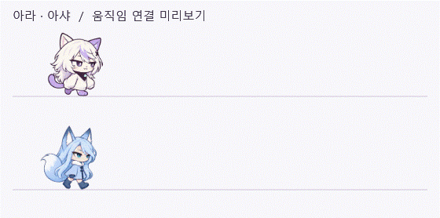

# 아라·아샤의 동작 연결 개선

2026-09-20 · UnityBridge Desk와 리틀 모델 엔진에 각각 적용했다. 코드·그림·설정의 자동 동기화는 추가하지 않는다.

## 달라진 동작

- 걷기는 출발·정지 구간의 속도를 부드러운 곡선으로 바꾼다. 가속도가 갑자기 시작하거나 끝나지 않으며 이동 거리와 보폭의 대응은 유지한다.
- 아라의 보폭도 표시 크기에 맞춘다. 몸 전체의 상하 움직임은 줄이고, 발을 딛는 지점에서 속도가 끊기지 않는 곡선을 사용한다.
- 몸을 웅크리기·점프·낙하·착지·들리기·대기는 현재 표시된 자세에서 이어진다. 큰 변화에도 새 효과를 쌓거나 처음 자세로 되돌리지 않는다.
- 착지는 접촉 뒤 약 65ms 동안 충격을 흡수하고 높이에 맞는 시간에 회복한다. 귀와 꼬리의 흔들림은 점차 작아진다.
- 시선은 목표를 천천히 따라가고 귀와 꼬리는 조금 늦게 반응한다. 여우의 큰 꼬리는 고양이보다 늦게 따라온다.
- 숨쉬기는 캐릭터마다 시작 시점과 주기가 다르다. 넓은 발판에서는 아라가 기지개를 켜거나 체중을 옮기고, 아샤가 귀를 세우며 옆을 살피는 동작을 고른다.
- 대기 동작은 한 종류에 치우치지 않게 번갈아 선택한다. 기존 대기 간격을 유지하며 좁은 발판에서는 기지개·체중 이동을 하지 않는다.

## 앱별 처리

Desk는 기존 발판 탐색·낙하·입력 중 정지 규칙을 유지한다. 이동 중에는 위치 갱신을 16ms 간격으로 요청하고 쉬는 동안에는 40ms로 낮춘다.

리틀 모델 엔진에는 양쪽 캐릭터의 지상 가감속, 방향을 살핀 뒤 돌아서기, 점프 직전의 웅크리기를 적용한다. 아샤도 착지를 먼저 마친 뒤 주변을 살핀다. 준비 중 창이 사라지면 아래로 떨어진다. 이동 중 16ms, 정지 중 33ms 간격으로 위치 갱신을 요청한다.

그림 제어는 활동 중 16ms, 대기·수면 중 33ms 간격으로 요청한다. 위치와 동작 계산에는 실제 경과 시간을 사용한다. 이는 갱신 요청 간격이며 모든 PC에서 특정 프레임 속도를 보장하는 뜻은 아니다.

기존 그림을 재사용하고 자세 보간과 작은 변형을 적용했다. 아라의 걷기 4프레임, 아샤의 걷기 8프레임은 그대로이다. Live2D·3D나 새로운 중간 그림을 생성한 것은 아니다.

## 참고 기준과 검증

프로젝트의 디자인 작업 기준, MOTION.md, CHARACTERS.md, ASHA-WALK.md와 캐릭터 크기·독립성 문서를 확인했다.

외부 [frontend-design](https://github.com/anthropics/skills/blob/main/skills/frontend-design/SKILL.md)의 고유한 표현과 절제 원칙, [UI/UX Pro Max](https://github.com/nextlevelbuilder/ui-ux-pro-max-skill/blob/main/.claude/skills/ui-ux-pro-max/SKILL.md)의 맥락별 시간·공간적 연속성·움직임 끄기 기준을 2026-09-20에 읽고 WPF에 맞춰 적용했다. 외부 스킬 설치나 검색 데이터베이스 실행은 하지 않았다. 웹용 레이아웃·폰트·장식 효과는 적용 범위에 넣지 않았다.

Desk 자동 검사 70개, 리틀 모델 엔진 검사 13개와 실제 네이티브 창 자가 검사를 통과했다. 자세 연결의 연속성, 착지 후 회복, 보폭·크기·배율, 좁은 발판의 동작 제한, 정지·숨김·낙하·사라진 발판을 검사했다. 벤치 명령·측정 구간·통계는 변경하지 않았고 실제 Unity나 AI 호출은 실행하지 않았다.

미리보기는 실제 WPF 컨트롤을 정해진 경로와 시간으로 렌더링한 것이다. 동작 연결을 보기 위한 장면이며 자율 탐색의 녹화나 프레임 성능 측정은 아니다.
