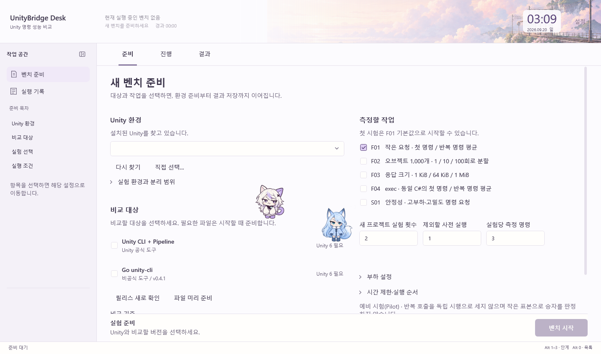
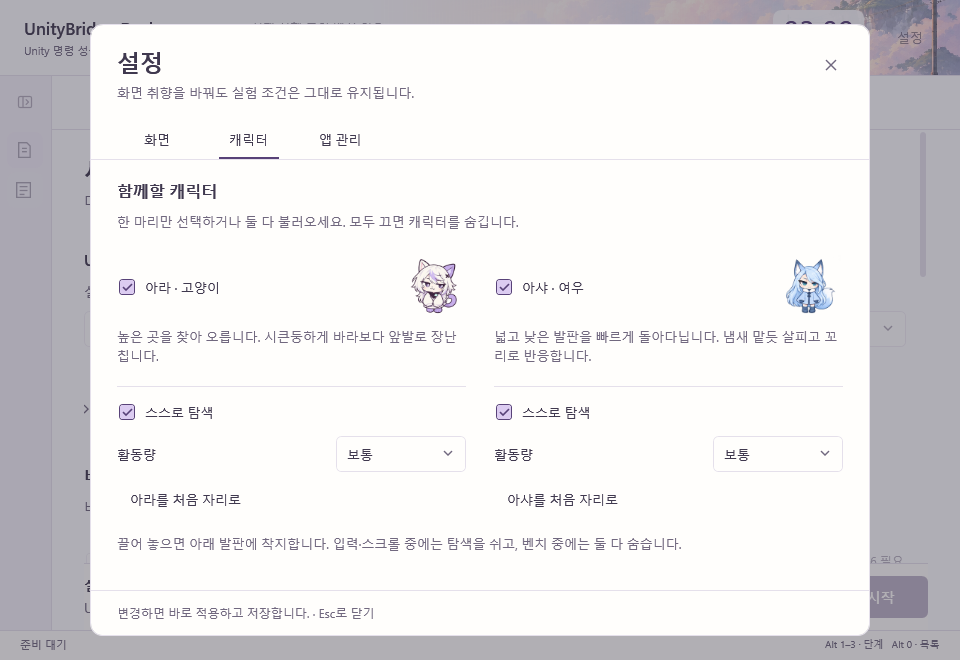

# 아라와 아샤

2026-09-20 구현 · v0.4.0 후속 변경을 v0.5.0 정식 배포에 통합했다. 기존 고양이의 이름은 **아라**, 새 여우의 이름은 **아샤**이다. 이전 문서·이미지에서 고양이를 아샤라고 부른 부분은 당시 이름이다.

## 사용법

Desk 안의 버튼·글줄·그래프 발판은 연속된 지지 구간과 낙하 접촉으로 계산한다. 화면 변경 직후 과거 발판을 제거하고 보이는 윗면에 발을 맞춘다. [현재 발판 계산과 검증](ASHA-CONTACT-GEOMETRY.md)

아샤의 걷기는 별도 8프레임 시트를 사용한다. 실제 이동량과 캐릭터 크기에 보폭을 맞추며, 대기·점프·낙하 등은 기존 포즈를 유지한다. [걷기 수정·실제 모션 미리보기](ASHA-WALK.md)

바탕화면에서도 쓰려면 별도 [리틀 모델 엔진](COMPANION.md)의 `LittleModelEngine.exe`를 실행한다. Desk와 캐릭터 파일·동작·설정·실행 상태를 자동으로 동기화하지 않는다. Desk 안의 캐릭터 선택과 설정은 유지된다.

두 종의 표시 크기는 실제 서 있는 키와 신발 밑면으로 보정한다. 같은 96 DIP 표시 영역에서 키는 약 80.6 DIP, 착지선은 위에서 85.4 DIP이다. 걷기·눈 감기·수면에서도 발의 기준점을 유지하며 수면 포즈의 웅크린 비율은 보존한다. [크기 보정과 분리 기록](CHARACTER-SCALE-AND-INDEPENDENCE.md)

**설정 → 캐릭터**에서 `아라 · 고양이`와 `아샤 · 여우`를 각각 선택한다. 하나만 선택하거나 둘 다 선택할 수 있다. 둘 다 해제하면 모두 숨는다. 캐릭터별 탐색 켜기·끄기, 활동량, 처음 자리로 돌아가기를 제공한다. 그림 미리보기는 움직이지 않는다.

기존 표시·탐색·활동량 설정은 아라에 이어진다. 아샤는 처음에는 꺼져 있으며 사용자가 켠 뒤부터 선택을 저장한다. 이름 변경 때문에 기존 고양이를 없애거나 두 번째 캐릭터를 임의로 표시하지 않는다. 배경 선택과 캐릭터 선택은 독립적이다.

| 구분 | 아라 · 고양이 | 아샤 · 여우 |
|---|---|---|
| 외형 | 은보라색 헝클어진 장발, 졸린 눈매, 둥근 스웨터와 가는 꼬리 | 아이스 블루의 매끈한 장발, 옆으로 넘긴 앞머리, 올라간 눈매, 케이프 코트와 풍성한 꼬리 |
| 목적지 | 높은 발판을 선호하고 위아래를 탐색 | 넓고 낮은 발판, 수평 이동을 선호 |
| 걸음 | 기존 속도와 연결된 걸음 | 같은 활동량에서 1.28배의 이동 속도 |
| 출발 전 | 목적지를 짧게 바라봄 | 0.6~0.95초 동안 냄새 맡듯 주변을 살핌 |
| 착지 후 | 자세 정돈 | 고개를 낮추고 주변 살피기 |
| 클릭 반응 | 힐끔 보기 → 앞발 장난 → 시큰둥한 반응 | 냄새 맡듯 살피기 → 앞발 장난 → 고개 돌려 살피기 |
| 대기 | 작은 호흡·귀 움직임·기지개 | 작은 호흡·귀 세우기·주변 살피기·꼬리 움직임 |

이 차이는 단순히 그림만 바꾼 것이 아니다. 같은 지도에서도 목적지 점수와 속도·출발 준비·반응 동작을 다르게 적용한다. 높이 선호는 방문 이력보다 우선하는 절대 규칙이 아니므로 같은 두 자리만 반복하지 않는다. 두 캐릭터의 현재 위치, 경로, 난수, 페이지별 기억, 방문 이력은 독립적이다. 새로 나타나거나 다음 목적지를 고를 때 다른 캐릭터가 차지한 자리를 피한다. 이동 중 두 캐릭터끼리의 물리 충돌이나 추격·대화는 구현하지 않는다.

## 놓았는데 떨어지지 않던 문제

이전에는 몸의 사각형이 글자나 입력칸과 겹치면 수직 낙하를 취소하고 다른 발판으로 복귀했다. 옆면이나 너무 좁은 도형에 닿아도 같은 처리를 하므로 일부 구간에서 낙하가 보이지 않았다.

자유 낙하는 이제 **위에서 내려올 때 발을 받치는 발판**을 기준으로 처리한다. 마우스를 놓은 위치가 글자와 겹쳐도 낙하를 시작한다. 매 프레임 발이 지난 높이 전체를 검사해 빠른 낙하가 얇은 발판을 건너뛰지 않게 한다. 두 발을 받치고 몸도 들어갈 수 있는 첫 발판에 가로 위치를 유지한 채 착지한다. 옆면과 너무 좁은 발판, 몸이 들어갈 수 없는 줄 사이에서는 계속 내려간다.

이 때문에 낙하 중에는 그림이 글자·입력칸을 잠시 지나갈 수 있다. 착지한 상태와 자율 이동 경로에는 기존의 내용 가림 방지 조건을 유지한다. 아래에 착지 가능한 발판이 없으면 화면 하단까지 떨어진 뒤 검증된 다른 발판으로 복귀하며, 안전한 자리가 전혀 없으면 숨는다. 화면 경계나 빈 클릭 영역을 바닥으로 만들지 않는다.

중력은 1,400 DIP/s², 최대 속도는 720 DIP/s이다. 이동 중 16ms, 쉬는 동안 40ms 간격으로 갱신을 요청하며 실제 경과 시간으로 움직인다. 스크롤·입력은 다음 탐색을 미루지만 이미 시작한 자유 낙하는 중단하지 않는다. 산책을 꺼도 끌어 놓은 캐릭터는 떨어진다. [동작 연결 개선](CHARACTER-MOTION.md)

## 정지와 데이터

설정 팝업·벤치 실행 중에는 두 캐릭터를 숨기고 정지한다. 앱 비활성화·최소화·Windows 애니메이션 끄기·화면 움직임 끄기에도 두 캐릭터의 타이머가 멈춘다. 멈추는 순간 공중에 있으면 안전한 자리로 정리한다. 현재 페이지를 바꿀 때 각각의 이전 자리를 새 화면에서 다시 검증한다.

고양이는 기존 `ShowCompanion`, `CompanionRoaming`, `CompanionActivity` 설정을 사용한다. 여우는 `ShowFoxCompanion`, `FoxRoaming`, `FoxActivity`를 추가한다. 그림·행동·설정만 변경하며 벤치 명령, 타이머의 측정 범위, 성공 판정과 통계에는 연결하지 않는다. 두 캐릭터의 그래프 방문 상태는 소유자별로 관리해 한 마리가 떠났다고 다른 한 마리의 숫자 가림 방지가 풀리지 않게 한다.

## 디자인과 자산

[디자인 작업 기준](../design/UI-DESIGN-WORKFLOW.md), [모션](MOTION.md), [기존 발판 설계](ASHA.md), [자유 낙하](ASHA-FALLING.md)를 조합했다. 2026-09-20에 외부 frontend-design과 UI/UX Pro Max의 SKILL.md를 열어 확인했다. 제품 고유의 캐릭터성, 이름과 조작의 일치, 공간적 연속성, 키보드 접근, 움직임 끄기 원칙을 적용했다. 웹용 폰트·CSS·호버 장식과 새로운 패널 스타일은 가져오지 않았다. 외부 스킬 설치나 검색 데이터베이스 실행은 하지 않았다.

설정은 두 캐릭터를 나란히 비교·선택하는 배치이다. 개별 그림은 정지 미리보기이며 기존 연보라 강조색과 글꼴을 유지한다. 작은 창에서는 팝업 안쪽만 스크롤하고 닫기·저장 상태는 고정한다.

아라의 기존 원본은 수정하지 않았다. 아샤의 4×2, 8프레임 PNG는 내장 image_gen 도구로 기존 시트를 편집해 만든 별도 자산이다. 색만 다른 인상을 줄이기 위해 아샤의 머리·눈매·의상 실루엣을 구분했다. 외부 API나 CLI 폴백을 사용하지 않았다. [자산과 전체 프롬프트](CHARACTER-ASSETS.md) · [외형 구분 설계](ASHA-CHARACTER-DISTINCTION.md)

위 화면은 별도 상태 폴더의 실제 WPF 준비 화면이다. 캐릭터 외형과 착지 위치를 검토하기 위해 유효한 발판을 지정했다. 새 벤치 측정이나 두 캐릭터의 자율 탐색을 실측한 결과를 뜻하지 않는다.

## 검증

Desktop 검사 66개가 통과했다. `TestResults/Desktop.DualCompanions.trx`에 기록한다. 글자·입력칸과 겹친 낙하 시작, 좁은 발판 통과, 빠른 낙하의 착지, 발판 삭제·스크롤, 일시 정지·숨기기를 검증한다. 같은 지도와 난수 조건에서 종별 목적지 선택 차이, 별도 설정 저장, 과거 설정 호환, 동시 표시와 그래프 방문 상태도 검사한다.

실제 WPF 준비 화면과 설정 팝업을 1440×850·960×660에서 렌더링하고, 기존 통합 렌더 검사에서는 100·150·200% 배율을 확인했다. 두 캐릭터의 외형과 버튼·목록의 잘림, 작은 창에서 설정 도달 가능성을 검토했다. 미리보기는 별도 데이터 폴더를 사용하고 Unity 벤치를 시작하지 않는다.

