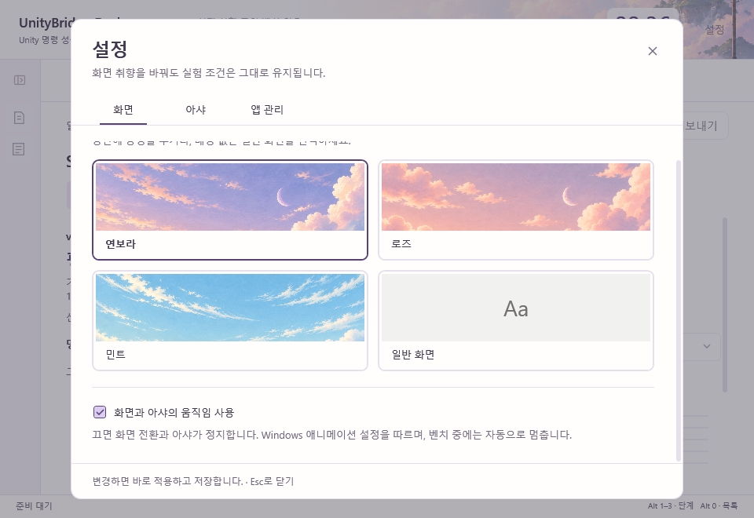

# 설정 팝업 적용 기록

2026-09-19 · Desk v0.4.0

설정 메뉴를 열고 전용 페이지로 이동하던 두 단계를, 설정 버튼 한 번으로 현재 작업 위에 팝업을 여는 동작으로 바꾼다. 준비·진행·결과와 실행 기록의 입력·선택·스크롤을 그대로 둔다. 화면과 아샤의 취향 설정을 실험 설정과 구분한다.

## 디자인 판단

저장소의 `AGENTS.md`, `design/UI-DESIGN-WORKFLOW.md`, `docs/UI-NAVIGATION.md`와 현재 모션·아샤 문서를 확인했다. 같은 날 앞서 원문을 읽은 frontend-design의 제품 중심 배치와 UI/UX Pro Max의 포커스·입력·작은 화면 원칙을 조합했다. 외부 스킬 설치나 스타일 검색 스크립트 실행은 하지 않았다.

연보라·로즈·민트와 일반 화면을 유지하고, 화면·아샤·앱 관리 세 분류로 내용을 나눈다. 배경 네 가지는 두 열로 미리 본다. 구획은 제목과 얇은 선으로 나누고 장식용 카드·배지·등장 효과를 늘리지 않는다. 기존 작업 단계와 구별되는 작은 분류 탭을 사용한다. 창을 끌어 이동하는 기능은 추가하지 않는다.

## 동작

- 최대 780 × 640 DIP의 중앙 팝업이며 창의 남은 공간에 맞춰 작아진다. 바깥 여백은 24 DIP이다. 내용만 스크롤하며 분류·닫기·저장 상태는 고정한다.
- 변경은 즉시 저장한다. 기존 저장 잠금과 취향 설정 전용 저장 경로를 사용하므로 실험 입력이 불완전해도 화면 취향을 바꿀 수 있다. 저장 실패는 하단에 표시한다.
- X·Escape·바깥 클릭으로 닫는다. 활동량 드롭다운이 열린 상태의 첫 Escape는 목록만 닫는다. 키보드 이동은 팝업 안에서 순환한다. 닫으면 이전 포커스로 복귀하고 해당 요소가 사라졌으면 설정 버튼을 사용한다.
- 작업면의 입력과 준비·진행·결과 전환 단축키를 잠시 차단한다. 벤치 실행·진행 갱신은 계속된다. 화면을 재생성하지 않으므로 기존 목록과 검색을 보존한다.
- 아샤의 탐색·프레임을 정지하고 숨긴다. 팝업은 아샤의 발판 수집 범위 밖에 둔다. 닫을 때 사용자 설정·벤치 실행·창 활성 상태에 따라 다시 움직인다. 팝업에서 ‘처음 자리로’를 선택하면 정지 중에도 안전한 발판으로 복귀시킨다.

## 검증

실제 WPF를 별도의 상태 폴더로 열어 기존 S01 검증 기록 위의 세 분류, 작은 창, 하단 스크롤과 결과 복귀를 렌더링했다. 데스크톱 검사 47개가 모두 통과했다. 취향만 저장하기, 결과·기록 선택 유지, 팝업 외부 입력 차단, Escape의 중첩 처리, 벤치 중 정지 유지와 100·150·200% 렌더링을 포함한다. 검사 결과는 `TestResults/Desktop.SettingsPopup.trx`에 기록했다.

Unity 실험이나 유료 AI 호출은 실행하지 않는다. 측정 명령·시간 구간·집계·성공 판정·정리 규칙은 변경하지 않는다.
