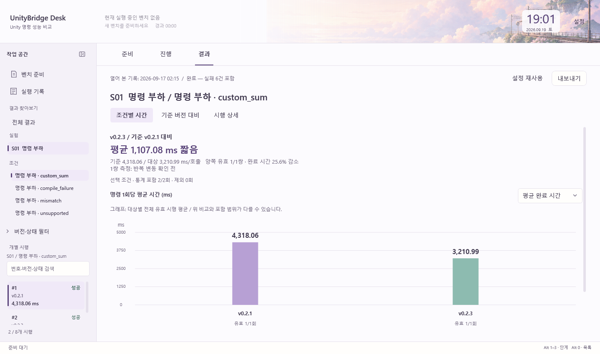
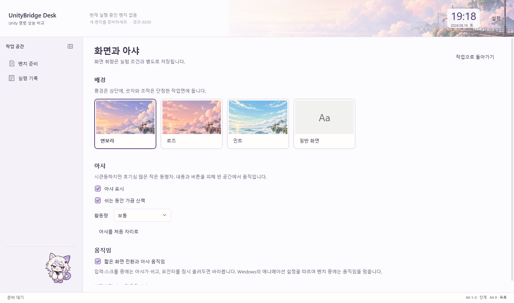

# 합의한 UI 방향 적용 점검

2026-09-19 · Desk v0.4.0. 이번 범위는 사용자가 확인한 **UI·배경·아샤·편의성**이다. API 모델 비교는 제외한다.

## 적용 상태

| 합의한 방향 | 실제 앱 적용 |
|---|---|
| 정보 우선, 세련되고 단정한 작업면 | 고정 좌측 탐색과 중앙 작업면을 유지한다. 위젯 열·대형 시계·장식 카드가 작업을 밀어내지 않는다. |
| 기존 풍경의 그림체만 리터칭 | 역과 구도·색·구름을 보존한 연보라·로즈·민트 이미지를 프로젝트에 내장했다. 상단 풍경과 불투명한 내용 영역을 나눈다. |
| 테마 3종과 일반 화면 | 설정의 네 가지 미리보기에서 직접 선택한다. 일반 화면은 이미지 없는 중립 색면이다. 선택은 다음 실행에도 복원한다. |
| 아샤의 외형과 성격 | 장발·고양이 귀·시큰둥한 눈과 작은 몸의 SD 외형을 유지한다. 글로우를 사용하지 않는다. |
| 자율성과 입력 반응 | 이미 적용된 빈 공간 산책·둘러보기·졸기·장난·포인터·클릭·끌어 놓기를 유지한다. 활동량을 직접 선택하고 산책만 멈출 수 있다. |
| 마스코트 켜기/끄기 | 일반 화면과 별도로 선택한다. 모든 관련 설정을 화면·아샤 페이지에 모았다. |
| 아샤가 내용을 가리지 않기 | 안전한 자리가 확인되기 전에는 숨긴다. 진행·결과에 캐릭터 전용 여백을 예약하지 않는다. 공간이 부족하면 잠시 숨는다. |
| 부드럽고 일관된 모션 | 기존 탭 밑줄·내용 전환·목록·버튼·펼침 모션을 보존한다. 기록·설정도 같은 작업면에서 전환한다. 사용자·Windows 설정과 벤치 중 정지 조건을 따른다. |
| 준비·진행·결과 이동의 명확성 | 탭은 그대로 유지한다. Ctrl+N은 초안, Ctrl+H는 실행 기록, Escape는 작업 복귀다. 상단 진행 요약을 누르면 현재 실행으로 돌아간다. |
| 기록과 시행 찾기 | 실행 기록을 전용 검색 목록으로 분리했다. 선택 후 열기·Enter·더블클릭으로 결과를 연다. 시행 인덱스는 좌측에 유지한다. |
| 초기 설정의 번거로움 감소 | 기존 자동 발견·자동 파일 준비를 유지하고, 준비 부족이나 잘못된 값에는 해당 입력으로 이동하는 동작을 추가했다. |
| 상태를 잃지 않는 조작 | 기록을 봐도 준비 초안을 지우지 않는다. 조건·기록별 필터와 시행 선택·스크롤 보존은 유지한다. 사이드바 접기·펼치기는 새로 영구 저장한다. |
| 결과를 빠르게 이해하기 | 전체 조건 비교표, 세로 그래프, 기준 대비 차이, 시행 상세와 통합 내보내기를 유지한다. 집계·측정 로직은 변경하지 않는다. |

## 설계 자료의 조합

[frontend-design SKILL.md](https://github.com/anthropics/skills/blob/main/skills/frontend-design/SKILL.md)의 실제 내용 중심 구성을 시각 방향으로 삼았다. [UI/UX Pro Max SKILL.md](https://github.com/nextlevelbuilder/ui-ux-pro-max-skill/blob/main/.claude/skills/ui-ux-pro-max/SKILL.md)와 [quick-reference](https://github.com/nextlevelbuilder/ui-ux-pro-max-skill/blob/main/.claude/skills/ui-ux-pro-max/references/quick-reference.md)의 탐색·입력 안내·키보드·동작 감소 기준을 WPF에 맞춰 참고했다. 두 원문은 이번 작업에서 다시 열었다. 외부 스킬 설치나 검색 스크립트 실행을 한 것은 아니다.

프로젝트의 [화면 구조](UI-NAVIGATION.md), [결과 의미](RESULTS.md), [구현 경계](DEVELOPMENT.md), [모션](MOTION.md), [이미지 제작 기록](THEME-ASSETS.md)과 결합했다. 오래된 VM 목표 명세는 현재 실행 명세와 구분했다. 웹 스택·색상·폰트 예제를 그대로 옮기지 않았고, 사용자가 정한 파스텔 정체성을 우선했다.

래스터 자산에는 설치된 Imagegen 스킬과 내장 이미지 편집 도구를 사용했다. [입력 파일과 전체 프롬프트](../design/landscape-retouch-prompts.json)를 보존한다. 기존 배경은 덮어쓰지 않고 새 파일로 저장했다.

## 검증과 경계

- Desktop 32개, Infrastructure 181개 검사 통과. 빌드 오류·경고 0개.
- 기존 600개 시행·100/150/200% WPF 렌더 검사를 유지했다. 작은 창의 날짜 잘림, 기록 검색·빈 목록·명시적 열기, 화면 설정 저장과 벤치 입력 보존을 확인했다.
- 실제 WPF 작업면을 1440×850과 960×660에서 렌더링했다. 결과 화면은 기존 S01 통합 검증 기록을 읽은 것이며 새 속도 실험을 실행하지 않았다.
- 아샤의 산책·프레임 정지·안전한 위치 복구와 벤치 중 숨김 검사를 유지했다. 실제 Unity 실행·다운로드·유료 모델 호출은 검증에 사용하지 않았다.
- 3D/Live2D 모델, 다른 Windows 프로그램 위를 돌아다니는 기능, API 모델 비교는 이번 적용에 포함되지 않는다. 과거의 큰 시계·우측 위젯·이동형 도구 패널은 최신 방향에 따라 되살리지 않는다.

