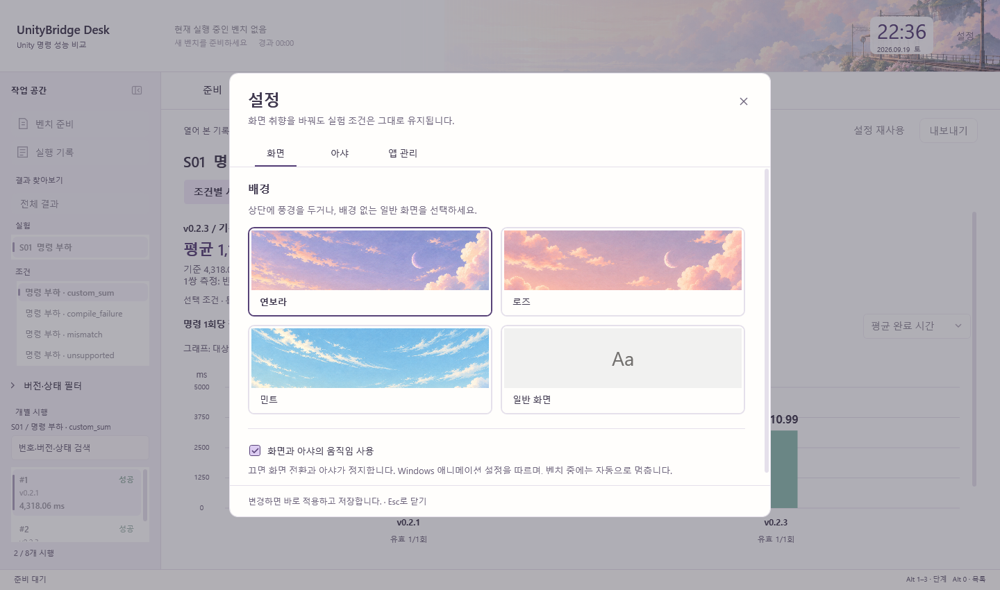

# 정보 중심 작업 화면

2026-09-19부터 진행한 Desk v0.4.0 UI 개편과 후속 개선을 v0.5.0에 통합했다. 아래는 현재 화면의 동작이다.

벤치의 설정·진행·판정이 화면의 중심이다. 좌측 탐색과 중앙 작업면으로 구성하며 우측 위젯 영역은 없앴다. 파스텔·연보라 색조는 유지하되 기존 역 풍경을 lofi 일러스트로 가볍게 리터칭해 상단에 사용하고, 내용 뒤는 불투명한 작업면으로 둔다. 연보라·로즈·민트 풍경과 배경 없는 일반 화면을 직접 선택한다. 시계는 상단 30 DIP이다. 96 × 96 DIP의 고양이 아라와 여우 아샤를 개별 또는 함께 표시한다. 버튼과 텍스트 줄을 발판으로 서로 다른 방식으로 탐색한다. 안전한 빈자리가 없는 작은 화면에서는 잠시 숨는다.

작업 화면 이미지는 2026-09-17의 S01 통합 검증 기록(8개 시행)을 읽은 화면이며 설정 이미지는 실제 WPF 설정 팝업이다. 이번 UI 개편에서 새 성능 실험을 실행한 결과가 아니다. 한 블록의 관찰값을 성능 우열의 확정 근거로 사용하지 않는다.

## 항상 찾을 수 있는 작업 입구

좌측의 **벤치 준비**는 입력 중인 초안으로 돌아가며 초기화하지 않는다. **실행 기록**은 날짜·버전·상태 검색이 있는 전용 목록을 연다. 항목을 선택한 뒤 **선택한 결과 열기**, Enter 또는 더블클릭으로 연다. 검색 결과가 없으면 안내와 준비 복귀 버튼을 표시한다. 기록은 최근 200개를 표시한다.

Ctrl+N은 준비, Ctrl+H는 실행 기록이다. 실행 기록의 **작업으로 돌아가기** 또는 Escape는 원래 작업 탭으로 복귀한다. 설정은 현재 작업 위에 팝업으로 열린다. 닫기 버튼·Escape·바깥 영역 클릭으로 닫고 기존 선택과 입력을 유지한다. 설정이 열려 있을 때 작업 전환 단축키는 차단한다. Alt+1·2·3은 보조 페이지에서도 해당 작업 탭을 직접 연다. 벤치 실행을 시작하면 상단 진행 요약을 눌러 진행 탭으로 돌아갈 수 있다. 기록 조회는 진행 중인 측정을 중단하지 않는다.

준비 화면 하단의 **확인할 설정으로**는 오류가 있거나 준비가 부족할 때 표시한다. 문제 입력이 접힌 항목 안에 있으면 펼치고 해당 위치로 스크롤한다. 초기화나 임의 값 변경은 하지 않는다. **벤치 시작**은 준비 완료 후 활성화된다.

진행·결과에서는 아샤를 위한 고정 하단 공간을 할당하지 않아 시행 목록에 더 많은 높이를 준다. 아샤 자체는 안전한 빈 공간이 있을 때 표시하며 벤치 중에는 숨긴다.

## 화면별 정보 순서

| 단계 | 좌측 | 중앙 |
|---|---|---|
| 준비 | Unity 환경 / 비교 대상 / 실험 선택 / 실행 조건 바로가기 | UnityBridge·공식 CLI·Go를 같은 형태의 선택 행으로 표시한다. 기준 여부와 Unity 6 필요 여부를 가까이 표시한다. 넓으면 두 열, 좁으면 한 열이며 실행 계획과 시작 버튼은 하단에 고정한다. |
| 진행 | 원래 시행 번호 검색, 전체 / 진행 중 / 실패·정리 실패 필터 | 관측한 단계와 종료 횟수를 표시한다. 실패 수 버튼으로 실패 시행만 확인한다. 선택한 시행과 현재 실행 시행을 구분하며 상세 로그는 펼친다. |
| 결과 | 전체 결과 / 실험 / 조건 / 시행 번호·버전·상태·시간 | 처음 연 기록은 전체 조건의 비교표를 표시한다. 행을 선택하면 해당 조건의 세로 그래프로 연결한다. 기준 버전 대비와 시행 상세도 유지한다. |

전체 비교표는 실험·조건·후보별로 기준 평균, 후보 평균, 단위, 시간 증감, 유효/계획 쌍 수를 표시한다. 순서는 실험 조건과 기록에 저장된 후보 순서를 따른다. 비교 대상이 여러 개라도 전체 우승자를 정하지 않는다. 표의 평균은 공동 유효 블록의 기존 ReportComparison 집계를 사용한다. `전체 결과` 버튼으로 돌아갈 수 있다.

실험 코드 F01~S01은 작업 종류이며 #1~#600은 계획한 개별 시행 순서이다. 검색·필터 후에도 원래 번호를 유지한다. 숫자 또는 #번호는 정확한 번호로, 버전·상태는 부분 검색한다. 결과 검색은 선택한 실험·조건 안에서 수행한다. 그래프 막대나 제외 시행 확인으로 이동하면 기존 검색어를 해제한다.

진행 중 다른 시행을 읽어도 새 이벤트가 선택을 빼앗지 않는다. 현재 시행으로 버튼은 검색·상태 필터를 해제하고 현재 시행으로 이동한다. 목록 선택은 조회이다. 설정 재사용은 준비 입력만 복원하며 새 벤치를 시작하지 않는다.

## 비교 수치의 기준

전체 비교표·상단 평균 차이·기준 버전 대비 화면에는 감소율 95% 구간과 해석을 함께 표시한다. 구간에 0%가 포함되면 방향이 불확실하다. 유효 5쌍 미만·미완료·실패 제외를 구분한다. 비교 화면의 **측정 신뢰도와 다음 실험**을 펼치면 분산·비용·다음 반복 수와 시행 순서를 읽는다. 다음 실험 준비는 모든 조건을 검사하고 적용 불가 이유를 표시한다. 시행 상세의 **호출 순서**는 사전 실행과 측정을 구분하며 기존 속도 평균을 바꾸지 않는다. [수식과 전제](STATISTICAL-METHODOLOGY.md)

비교 후보가 하나이면 기준 대비 평균 시간 차이와 증감률을 크게 표시한다. 양쪽 모두 유효한 같은 블록만 사용하며 단 한 블록이면 반복 변동 미확인을 표시한다. 후보가 여럿이면 비교 가능한 후보 수를 표시하고 기준 버전 대비 화면으로 안내한다. 공동 유효 블록이 없으면 비교할 수 없다고 표시한다.

상단에는 후보와 기준을 먼저 명시하고 평균 차이, 두 평균, 단위와 유효 쌍 수를 표시한다. 상단 평균 차이와 전체 비교표는 공동 유효 블록, 그래프는 대상별 전체 유효 시행을 사용한다. 포함 범위가 다를 수 있다는 설명을 그래프 위에 항상 표시한다. 한 쌍만 있으면 반복 변동 확인 전이라고 표시한다.

안정성 화면은 유효 완료 수와 평가 대상 수를 표시한다. 환경 준비·호환성 오류와 중단·미수행은 평가 분모에서 제외하고 정리 실패는 포함한다. 통계 포함/계획 횟수도 별도로 표시한다. 성공하지 않은 시행을 0ms로 표시하지 않는다.

## 조작과 배치

- 좌측은 232 DIP, 접으면 52 DIP이다. 창 폭이 1060 DIP보다 좁으면 기본으로 접고, 사용자가 접기·펼치기를 선택하면 다음 앱 실행에도 복원한다. 상단의 사이드바 아이콘 또는 Alt+0으로 전환한다. 접힌 상태에서도 하나의 36×36 DIP 버튼을 유지하며 세로 글자나 중복 버튼을 표시하지 않는다. 포인터에는 옅은 배경과 동작 설명, 키보드에는 얇은 실선 포커스를 표시한다.
- Alt+1·2·3은 준비·진행·결과 전환이다. 위의 작업 단계와 결과 안의 세부 보기 버튼은 서로 다른 모양으로 구분한다. 목록은 방향키로 이동하며 포커스와 선택을 구분한다.
- 작업 탭에는 준비·진행·결과 이름만 표시한다. 선택은 굵은 글자와 짧은 밑줄, 포인터는 옅은 바탕, 키보드 포커스는 얇은 실선으로 구분한다. 세 탭의 클릭 영역은 같은 너비를 유지하며 눌렀을 때 탭 전체를 축소하지 않는다.
- 좌측의 조건·필터와 시행 목록은 독립적으로 스크롤한다. 시행 검색 입력은 둘 사이에 고정한다. 필터를 펼쳐도 시행 목록의 공간을 남긴다.
- 그래프는 남은 높이에 맞춰 170~340 DIP로 조정한다. 작은 창에서는 중앙 전체를 스크롤한다. 긴 표의 양 끝에서는 바깥 스크롤로 이어진다.
- 내보내기 한 메뉴에 비교 요약 TXT, 요약 복사, 분석 Excel, 현재 그래프 SVG, 보고서 폴더, 원본·로그 폴더를 모았다. 설정 재사용은 별도 버튼이다.
- 내보내기는 요약·분석·폴더 항목 사이를 구분선으로 나눈다. 전체 결과를 보는 동안에는 선택 조건의 SVG 저장을 비활성화하여 보이지 않는 그래프를 저장하지 않도록 한다.
- 같은 창에서 조건과 기록을 오가면 검색·버전·상태 필터, 선택한 시행, 결과 보기와 세로 스크롤 위치를 복원한다. 앱 재시작까지 저장하는 설정은 아니다. 시행 상세의 이전/다음 버튼은 현재 필터 목록 안에서 이동한다.
- 그래프 막대 영역은 포인터에 반응하며 버전·시간·유효 횟수와 상세 이동 안내를 표시한다. 키보드 선택과 버전별 순서·색상은 유지한다.
- 시행 상세는 번호·버전·실험, 상태, 대표시간, 확인된 내용을 먼저 보여준다. 응답 검증·오류·식별 정보와 수치 표는 펼쳐 본다.

## 보조 요소

**설정**을 한 번 누르면 현재 작업 위에 팝업이 열린다. 화면·캐릭터·앱 관리로 나누어 배경과 움직임, 아라와 아샤 각각의 표시·탐색·활동량, 데이터 폴더와 최근 알림을 고른다. 변경은 즉시 적용·저장되며 별도 적용 버튼은 없다. 저장에 실패하면 팝업 하단에 이유를 표시한다.

팝업 내부 내용만 스크롤하고 분류·닫기·저장 상태는 고정한다. Escape·닫기·바깥 영역 클릭으로 닫으며 작업 탭, 기록 검색과 선택, 실험 입력을 초기화하지 않는다. 활동량 목록이 펼쳐져 있으면 첫 Escape는 목록만 닫는다. 키보드 포커스는 팝업 안에서 순환하고 뒤쪽 작업의 클릭·전환 단축키는 잠시 차단한다. 벤치 실행 자체는 계속 진행한다. 설정을 열면 두 캐릭터는 잠시 숨고 정지하며 닫은 뒤에도 벤치 중이면 계속 정지한다.

상단은 현재 앱의 실행 단계·종료 횟수·경과 시간·시계를 표시한다. 결과 상단은 `열어 본 기록`의 날짜와 상태를 별도로 표시한다. 최근 실행을 완료하면 현재 실행 중인 벤치가 없다는 점을 명시한다. 최근 알림은 설정에서 확인한다. **설정** 팝업에서 네 가지 배경을 미리보고 직접 고른다. 일반 화면은 중립 색면이며 아샤 표시는 별도로 선택한다.

아샤는 장발·큰 머리·작은 몸·반쯤 뜬 눈·송곳니를 가진 고양이 SD 캐릭터이다. 2D 프레임으로 걷기·눈 깜빡임·졸기·장난을 표현하고, 발판의 연결 경로를 찾아 걷기·웅크림·점프·뛰어내리기·착지로 계속 이동한다. 탐색 중 긴 휴식·자동 수면은 사용하지 않는다. 포인터·클릭·Enter·Space에 반응하며 끌어 놓을 수 있다. 표시·산책·활동량을 설정하고 저장한다. 벤치 시작, 앱 비활성화·최소화 시 프레임과 자율 판단을 함께 멈춘다. Windows 애니메이션 설정도 따른다. [아샤 사용법과 로직](ASHA.md) · [화면 모션](MOTION.md) · [제작 기록](THEME-ASSETS.md)

작업 탭의 선택 밑줄만 160ms 이동하고 본문은 제자리에서 120ms 동안 짧게 전환한다. 결과 보기·조건·시행 상세는 즉시 바꾼다. 버튼 축소, 목록·본문의 중복 이동, 메뉴·펼침 내용의 등장 효과를 제거했다. 포인터·선택·오류·키보드 포커스는 정적인 강조로 유지한다. [현재 모션 규칙](MOTION.md)을 참고한다.

## 구현과 검증

WPF의 Grid·TabControl·ListBox와 기존 SpeedReport 모델을 사용한다. 외부 UI 라이브러리를 추가하지 않았다. 목록은 가상화하며 시각 변경으로 CLI 측정 구간·성공 판정·시간 집계·정리 규칙을 바꾸지 않는다.

선행 개편에서는 Core 38개, Infrastructure 181개, Desktop 28개, 총 247개 자동 검사를 통과했다. 현재 반응 절제 변경의 검증은 [UX 적용 기록](UX-CALMING-20260919.md)에 별도로 기록한다. WPF 검사는 100·150·200% 렌더링, 작은 창과 넓은 창의 준비 배치, 600개 합성 시행의 가상화·번호 검색·선택 유지·필터, 메뉴와 스크롤을 확인한다. 평균 차이에 공동 유효 평균을 사용하는지, 캐릭터·움직임 설정이 실험 입력을 보존하는지, 실행 중 마스코트가 정지하는지도 검사한다. 별도의 화면 밖 WPF 창에서 동작 시작·정지·숨김·종료, 애니메이션 시계 해제, 빠른 전환의 원위치 복귀와 비활성 버튼의 투명도 보존을 확인한다.

이전 실제 Go 비교의 30개 시행·286개 샘플을 새 결과 화면에서 열고 기록 선택과 결과가 일치함을 확인했다. 1230 × 800, 1440 × 850, 960 × 600 크기로 렌더링했다. 새 Unity 벤치나 유료 AI 모델 벤치는 실행하지 않았다.

캐릭터의 작은 데스크톱 동반자 역할은 사용자가 제시한 [Little LUMI Model](https://store.steampowered.com/app/5075020/_Little_LUMI_Model/?l=koreana)을 참고했다. 해당 게임의 이미지·모델 파일을 앱에 넣지는 않았다.

[결과를 읽는 기준](RESULTS.md) · [전체 사용법](USAGE.md)

디자인 조합과 채택·제외한 원칙은 저장소의 `design/UI-APPLICATION-20260919.md`, 이후 작업 기준은 `design/UI-DESIGN-WORKFLOW.md`에 기록했다.

최신 캐릭터의 이름·선택·행동·낙하 규칙은 [아라와 아샤](CHARACTERS.md)를 따른다.
